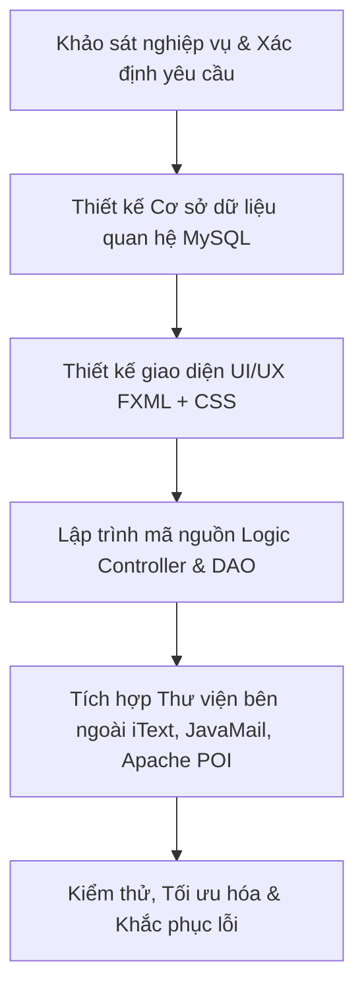
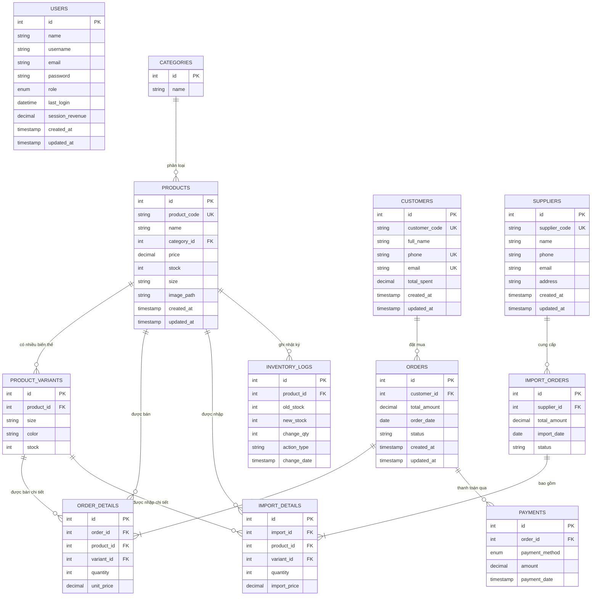

    # CHƯƠNG 2. PHÂN TÍCH VÀ THIẾT KẾ HỆ THỐNG

Chương này trình bày chi tiết các yêu cầu hệ thống, quy trình và các bước thiết kế để giải quyết bài toán quản lý cửa hàng bán giày dép thực tế. Nội dung bao gồm việc phân tích chi tiết các chức năng nghiệp vụ, xây dựng kiến trúc phần mềm theo mô hình MVC kết hợp DAO, thiết kế cơ sở dữ liệu quan hệ đồng bộ (ERD), đặc tả các bảng dữ liệu và lập trình các triggers tự động hóa logic nghiệp vụ tại mức cơ sở dữ liệu.

---

## 2.1. ĐẶT VẤN ĐỀ VÀ MỤC TIÊU THIẾT KẾ

### 2.1.1. Đặt vấn đề
Các cửa hàng kinh doanh giày dép truyền thống thường gặp khó khăn lớn trong việc vận hành do những nguyên nhân sau:
*   **Quản lý tồn kho phức tạp**: Giày dép có nhiều thuộc tính đi kèm như mẫu mã, kích cỡ (size), màu sắc. Việc ghi chép thủ công dễ dẫn đến sai sót, nhầm lẫn số lượng tồn kho thực tế.
*   **Thanh toán chậm trễ và sai số**: Thu ngân tính toán thủ công hoặc dùng các phần mềm rời rạc không liên kết với kho hàng, dễ gây thất thoát doanh thu và kéo dài thời gian chờ đợi của khách hàng.
*   **Thiếu báo cáo trực quan**: Việc tổng hợp doanh thu, lợi nhuận và đánh giá các sản phẩm bán chạy thường tốn nhiều thời gian và không phản ánh kịp thời xu hướng kinh doanh theo thời gian thực.
*   **Rủi ro bảo mật tài khoản**: Các tài khoản quản lý và nhân viên dùng chung hoặc không có cơ chế mã hóa mật khẩu và khôi phục an toàn khi quên mật khẩu.

### 2.1.2. Mục tiêu thiết kế của hệ thống SoleManager
Hệ thống **SoleManager** được thiết kế nhằm mục đích:
1.  **Tối ưu quy trình bán hàng tại quầy (POS)**: Tích hợp máy quét mã vạch vật lý để tự động tìm kiếm sản phẩm và thanh toán nhanh chóng, tự động in hóa đơn PDF.
2.  **Quản lý kho hàng thông minh**: Đồng bộ hóa tự động số lượng tồn kho theo các biến thể sản phẩm (kích cỡ, màu sắc), tự động cảnh báo tồn kho thấp.
3.  **Hỗ trợ ra quyết định kinh doanh**: Cung cấp các biểu đồ thống kê doanh số trực quan (doanh thu theo ngày, cơ cấu danh mục bán chạy) và chức năng xuất báo cáo ra file Excel.
4.  **Đảm bảo an toàn thông tin**: Mã hóa mật khẩu một chiều, khôi phục mật khẩu thông qua mã OTP bảo mật gửi trực tiếp đến Email người dùng và phân quyền rõ ràng giữa Admin và Nhân viên.

---

## 2.2. YÊU CẦU HỆ THỐNG (SYSTEM REQUIREMENTS)

### 2.2.1. Yêu cầu chức năng (Functional Requirements)
Hệ thống quản lý cửa hàng bán giày bao gồm các phân hệ chức năng chính sau:

```
                  +-------------------------------------------------+
                  |             HỆ THỐNG SOLEMANAGER                |
                  +-------------------------------------------------+
                                           |
      +------------------+-----------------+------------------+------------------+
      |                  |                 |                  |                  |
+-----------+      +-----------+     +-----------+      +-----------+      +-----------+
| Phân hệ   |      | Phân hệ   |     | Phân hệ   |      | Phân hệ   |      | Phân hệ   |
| Xác thực  |      | Bán hàng  |     | Kho hàng  |      | Đối tác   |      | Báo cáo   |
| & Bảo mật |      | POS       |     | & Sản phẩm|      | & Khách   |      | Thống kê  |
+-----------+      +-----------+     +-----------+      +-----------+      +-----------+
```

1.  **Phân hệ Xác thực & Bảo mật**:
    *   *Đăng nhập & Đăng ký*: Xác thực tài khoản nhân viên và người quản lý.
    *   *Khôi phục mật khẩu (Forgot Password)*: Gửi mã xác thực OTP gồm 6 chữ số qua Email đăng ký của nhân viên để đặt lại mật khẩu mới.
    *   *Phân quyền (RBAC)*: Phân chia vai trò rõ ràng:
        *   **ADMIN (Quản trị viên)**: Toàn quyền truy cập và thao tác trên mọi chức năng (Dashboard, Sản phẩm, Danh mục, Nhà cung cấp, Lịch sử nhập, Báo cáo, Nhân viên).
        *   **STAFF (Nhân viên bán hàng)**: Chỉ được phép truy cập giao diện Bán hàng POS và xem lịch sử đơn hàng của cửa hàng; các menu quản trị khác trên Sidebar sẽ bị ẩn hoàn toàn để đảm bảo tính an toàn hệ thống.

2.  **Phân hệ Bán hàng POS (Point of Sale)**:
    *   *Quản lý giỏ hàng*: Thêm sản phẩm vào giỏ hàng bằng cách click chọn hoặc quét mã vạch SKU của sản phẩm. Kiểm soát nghiêm ngặt số lượng tồn kho tối đa (không cho phép thêm vượt quá số lượng giày thực tế trong kho).
    *   *Liên kết Khách hàng*: Tìm kiếm nhanh khách hàng bằng tên hoặc số điện thoại (tự động gợi ý danh sách). Tích hợp Dialog thêm nhanh khách hàng mới ngay tại quầy bán hàng mà không cần rời trang.
    *   *Thanh toán & In hóa đơn*: Hỗ trợ nhiều phương thức thanh toán (Tiền mặt, Chuyển khoản qua Ngân hàng, Ví điện tử Momo). Tự động tạo và mở file hóa đơn định dạng PDF chuyên nghiệp để in trực tiếp cho khách hàng.

3.  **Phân hệ Quản lý Sản phẩm & Tồn kho**:
    *   *CRUD Sản phẩm*: Thêm mới, chỉnh sửa thông tin sản phẩm và thiết lập hình ảnh minh họa. Kiểm tra các ràng buộc khóa ngoại để ngăn chặn hành động xóa sản phẩm nếu sản phẩm đó đã từng phát sinh giao dịch trong lịch sử.
    *   *Tối giản quy trình nhập kho*: Khi thêm một sản phẩm mới, hệ thống tích hợp trực tiếp thông tin chọn Nhà cung cấp và Giá nhập kho ngay tại Dialog thêm sản phẩm. Hệ thống sẽ tự động thực hiện một Database Transaction để ghi nhận đồng thời thông tin sản phẩm, tạo phiếu nhập kho và chi tiết phiếu nhập nhằm đảm bảo số liệu đồng bộ.

4.  **Phân hệ Quản lý Danh mục & Nhà cung cấp**:
    *   *Quản lý Danh mục*: Phân loại giày (Giày thể thao, giày tây, sandal...). Tự động thống kê số lượng giày thuộc từng nhóm danh mục. Ngăn chặn xóa danh mục nếu còn chứa sản phẩm.
    *   *Quản lý Nhà cung cấp*: Quản lý thông tin các nhà cung cấp nguồn hàng đầu vào. Ràng buộc kiểm tra tính hợp lệ của dữ liệu nhập (Số điện thoại bắt đầu bằng số `0` gồm 10 chữ số; Email đúng định dạng chuẩn).

5.  **Phân hệ Quản lý Đơn hàng & Phiếu nhập kho**:
    *   *Lịch sử Đơn hàng*: Tra cứu toàn bộ các hóa đơn đã bán. Cho phép xem chi tiết các mặt hàng trong từng hóa đơn.
    *   *Hủy đơn hàng khôi phục kho*: Khi thực hiện hủy đơn hàng (ở trạng thái Đã thanh toán), hệ thống tự động hoàn trả số lượng giày tương ứng của đơn hàng đó quay ngược lại kho tồn của sản phẩm.
    *   *Lịch sử Nhập kho*: Hiển thị danh sách và chi tiết các phiếu nhập kho đã thực hiện với đầy đủ thông tin số lượng, đơn giá nhập và tổng tiền thanh toán cho nhà cung cấp.

6.  **Phân hệ Báo cáo & Thống kê**:
    *   *Dashboard tổng quan*: Thống kê nhanh các chỉ số KPI thời gian thực (Doanh thu ngày, Đơn hàng mới phát sinh trong ngày, Tổng số khách hàng hệ thống, Số lượng sản phẩm sắp hết hàng trong kho).
    *   *Biểu đồ trực quan*:
        *   Biểu đồ miền (`AreaChart`): Trực quan hóa doanh thu 7 ngày gần nhất.
        *   Biểu đồ tròn (`PieChart`): Phân tích cơ cấu tỷ lệ phần trăm doanh thu thu về theo từng Danh mục giày.
        *   Biểu đồ cột (`BarChart`): Liệt kê danh sách Top 5 sản phẩm bán chạy nhất.
    *   *Xuất Excel*: Tích hợp tính năng xuất toàn bộ bảng dữ liệu báo cáo doanh số chi tiết ra file Excel (`.xlsx`) phục vụ việc lưu trữ và đối soát.

### 2.2.2. Yêu cầu phi chức năng (Non-Functional Requirements)
*   **Bảo mật**: Mật khẩu người dùng được mã hóa một chiều bằng thuật toán băm **SHA-256** trước khi lưu trữ vào cơ sở dữ liệu MySQL, ngăn ngừa rủi ro rò rỉ thông tin ngay cả khi cơ sở dữ liệu bị lộ.
*   **Tính toàn vẹn dữ liệu**: Các thao tác cập nhật dữ liệu đa bảng (Thanh toán POS, Nhập kho) phải được bao bọc trong một Database Transaction (Commit/Rollback) để đảm bảo không xảy ra trạng thái dữ liệu mồ côi hoặc không đồng bộ.
*   **Tính khả dụng & Trải nghiệm người dùng (UX)**: Giao diện Glassmorphism hiện đại, có tông màu Slate & Indigo tinh tế, bố trí các phím tắt tiện lợi (`F1`: Thanh toán nhanh, `F2`: Tìm kiếm khách hàng, `ESC`: Hủy giỏ hàng) và các thông báo Toast nổi biến mất mượt mà.
*   **Hiệu năng xử lý**: Thời gian phản hồi các câu lệnh truy vấn dữ liệu từ MySQL kết hợp bộ lọc tìm kiếm tức thời trên TableView phải dưới **0.5 giây**.

---

## 2.3. CÁC BƯỚC THIẾT KẾ HỆ THỐNG

Quá trình thiết kế và triển khai ứng dụng SoleManager được thực hiện một cách tuần tự và khoa học qua các giai đoạn sau:



1.  **Bước 1: Khảo sát nghiệp vụ và Xác định yêu cầu**: Tìm hiểu quy trình làm việc thực tế tại một cửa hàng bán giày dép (bán hàng tại quầy, kiểm đếm kho, nhập hàng từ nhà phân phối và lập báo cáo doanh thu).
2.  **Bước 2: Thiết kế Cơ sở dữ liệu**: Lập sơ đồ thực thể mối quan hệ ERD, xác định các trường dữ liệu phù hợp, thiết lập các ràng buộc toàn vẹn dữ liệu (khóa chính, khóa ngoại, unique). Lập trình các Triggers mức CSDL để đồng bộ hóa số lượng tồn kho tự động.
3.  **Bước 3: Thiết kế Giao diện UI/UX**: Xây dựng cấu trúc layout bằng Scene Builder và mã FXML. Tùy biến sâu giao diện bằng CSS (`SoleManager.css` và `Style.css`) theo phong cách Glassmorphism hiện đại (bo góc, đổ bóng, màu sắc hài hòa).
4.  **Bước 4: Lập trình Logic nghiệp vụ**: Áp dụng mô hình thiết kế **MVC (Model-View-Controller)** kết hợp mẫu thiết kế **DAO (Data Access Object)**. Viết các lớp DAO thực hiện các câu lệnh SQL an toàn (`PreparedStatement`) để phòng chống lỗi SQL Injection.
5.  **Bước 5: Tích hợp thư viện bên thứ ba**:
    *   *iText PDF*: Phát triển module xuất hóa đơn bán hàng ra tệp PDF.
    *   *JavaMail API*: Cấu hình kết nối cổng SMTP của Gmail để tự động gửi mã OTP xác thực.
    *   *Apache POI*: Viết module xuất dữ liệu thống kê ra bảng tính Excel.
6.  **Bước 6: Kiểm thử và tinh chỉnh**: Chạy thử nghiệm các kịch bản sử dụng (bán hàng vượt số lượng tồn kho, hủy đơn hàng, gửi OTP khôi phục mật khẩu, lọc biểu đồ ngày tháng). Khắc phục các lỗi hiển thị biểu đồ và đồng bộ số liệu đơn hàng.

---

## 2.4. CHI TIẾT CÁC CHỨC NĂNG NGHIỆP VỤ

### 2.4.1. Hệ thống Xác thực, Phân quyền & OTP Khôi phục mật khẩu
*   **Đăng nhập & Mã hóa bảo mật**:
    *   Khi người dùng nhập tài khoản và mật khẩu, hệ thống sẽ sử dụng thuật toán mã hóa SHA-256 để băm mật khẩu đầu vào:
        $$\text{Password\_Hashed} = \text{SHA-256}(\text{Password\_Input})$$
    *   Hệ thống so khớp chuỗi băm này với trường `password` lưu trong bảng `users`.
*   **Quy trình gửi OTP 3 bước**:
    ```
    [Nhập Email] --> (Kiểm tra CSDL) -- Hợp lệ --> [Tự động tạo OTP & Gửi JavaMail]
                                                           |
    [Đổi Mật Khẩu] <-- (Xác thực OTP thành công) <-- [Nhập Mã OTP xác nhận]
    ```
    *   *Bước 1 (Gửi mã)*: Kiểm tra email người dùng nhập có tồn tại trong CSDL không. Nếu có, sinh ngẫu nhiên mã số gồm 6 chữ số và gửi qua email khách hàng.
    *   *Bước 2 (Xác thực)*: Người dùng nhập mã OTP từ email, hệ thống đối chiếu với mã OTP tạm thời được sinh ra.
    *   *Bước 3 (Đổi mật khẩu)*: Cho phép người dùng nhập mật khẩu mới, băm SHA-256 và cập nhật trực tiếp vào cơ sở dữ liệu.
*   **Phân quyền Động (Role-Based Interface)**:
    *   Lớp `SessionManager` lưu giữ trạng thái đăng nhập.
    *   Tại phương thức khởi tạo của giao diện chính (`MainController`), hệ thống kiểm tra:
        ```java
        if (SessionManager.getInstance().getRole() == Role.STAFF) {
            btnDashboard.setVisible(false);
            btnDashboard.setManaged(false);
            btnProducts.setVisible(false);
            btnProducts.setManaged(false);
            // Ẩn các chức năng ADMIN khác...
            loadView("/view/Sale.fxml"); // Chuyển thẳng tới trang bán hàng
        }
        ```

### 2.4.2. Giao diện bán hàng POS (Point of Sale) chuyên nghiệp
*   **Tìm kiếm & Quét mã vạch**:
    *   Hệ thống cài đặt bộ lắng nghe sự kiện gõ phím trên màn hình bán hàng để đón nhận tín hiệu quét mã vạch từ máy quét vật lý (Barcode Scanner). Máy quét tự động điền mã SKU sản phẩm và kết thúc bằng phím `Enter`.
    *   Hệ thống tự động phân tách mã SKU, tìm kiếm sản phẩm trong CSDL và thêm ngay sản phẩm đó vào giỏ hàng mà không cần nhân viên gõ thủ công.
*   **Kiểm tra tồn kho trong giỏ hàng**:
    *   Khi nhân viên bấm nút thêm sản phẩm hoặc tăng số lượng trong giỏ hàng, hệ thống thực hiện kiểm tra:
        $$\text{Số lượng yêu cầu} \le \text{Số lượng tồn kho thực tế (Stock)}$$
    *   Nếu vượt quá giới hạn tồn kho, hệ thống hiển thị thông báo Toast cảnh báo và tự động chặn hành động tăng số lượng.
*   **In hóa đơn tự động**:
    *   Sau khi lưu thông tin đơn hàng thành công vào cơ sở dữ liệu, thư viện `iText PDF` sẽ tự động tạo file hóa đơn PDF chuyên nghiệp chứa đầy đủ thông tin cửa hàng, khách hàng, các sản phẩm đã mua và tổng tiền.
    *   Tệp tin PDF được lưu trữ tự động vào thư mục `/invoices` của dự án với tên file là mã hóa đơn và được gọi mở trực tiếp lên màn hình máy tính thông qua ứng dụng đọc PDF mặc định.

### 2.4.3. Quy trình Nhập kho tối giản & Database Transaction
*   Để giảm thiểu các thao tác thủ công phức tạp của thủ kho, hệ thống đã loại bỏ nút nhập kho riêng biệt và tích hợp trực tiếp quy trình nhập kho vào bên trong màn hình Thêm sản phẩm mới.
*   Khi Admin điền thông tin sản phẩm mới, chọn nhà cung cấp và điền đơn giá nhập hàng, hệ thống tự động tính toán tổng số tiền nhập hàng:
    $$\text{Tổng tiền nhập} = \text{Tồn kho ban đầu} \times \text{Đơn giá nhập}$$
*   Khi nhấn lưu sản phẩm mới, để đảm bảo tính toàn vẹn dữ liệu giữa các bảng liên quan, phương thức `addProductWithImport(...)` trong `ProductDAO` sử dụng cơ chế giao dịch CSDL (Database Transaction) để thực hiện đồng thời:
    1.  Chèn thông tin sản phẩm vào bảng `products`.
    2.  Tạo mới một phiếu nhập kho trong bảng `import_orders`.
    3.  Tạo chi tiết phiếu nhập kho trong bảng `import_details`.
    ```java
    connection.setAutoCommit(false); // Bắt đầu Transaction
    try {
        // 1. Insert product
        // 2. Insert import_order
        // 3. Insert import_details
        connection.commit(); // Thành công thì lưu lại toàn bộ
    } catch (SQLException e) {
        connection.rollback(); // Gặp lỗi thì khôi phục lại trạng thái cũ
        throw e;
    }
    ```

### 2.4.4. Hủy Đơn hàng & Logic Hoàn trả tồn kho
*   Đây là một quy trình nghiệp vụ quan trọng trong quản lý bán lẻ. Khi một đơn hàng bị hủy do khách đổi trả hoặc sai sót, nhân viên có quyền hủy đơn (nếu có quyền hạn).
*   Khi đơn hàng bị chuyển trạng thái thành `'Da huy'`, hệ thống không xóa đơn hàng khỏi CSDL để phục vụ kiểm toán, mà thay vào đó sẽ thực hiện:
    1.  Cập nhật cột `status = 'Da huy'` trong bảng `orders`.
    2.  Truy vấn lấy toàn bộ danh sách sản phẩm và số lượng tương ứng trong bảng `order_details` của đơn hàng bị hủy đó.
    3.  Thực hiện cộng trả lại số lượng tồn kho tương ứng của từng mặt hàng vào bảng biến thể sản phẩm `product_variants` và cập nhật lại bảng tổng `products`.

### 2.4.5. Thống kê, Báo cáo & Xuất Excel
*   **Bộ lọc ngày tháng**: Hệ thống cho phép người quản lý lựa chọn mốc thời gian bắt đầu và kết thúc. Toàn bộ dữ liệu doanh thu, số lượng sản phẩm bán ra và lợi nhuận sẽ được tính toán lại theo mốc thời gian này.
*   **Công thức tính Lợi nhuận ước tính**:
    *   Hệ thống tính toán lợi nhuận thực tế dựa trên chênh lệch giữa giá bán thực tế và giá nhập kho (giá vốn) trong bảng `import_details`.
    *   Đối với các sản phẩm cũ chưa có thông tin phiếu nhập kho, hệ thống áp dụng biên lợi nhuận ước tính mặc định bằng $40\%$ giá bán (tương đương giá vốn ước định bằng $60\%$ giá bán):
        $$\text{Lợi nhuận} = \text{Giá bán} - \text{Giá vốn}$$
*   **Xuất Excel bằng Apache POI**:
    *   Hệ thống xuất dữ liệu báo cáo sang file định dạng `.xlsx`.
    *   Mã nguồn cấu hình bảng Excel chuyên nghiệp: Đổ màu nền thanh tiêu đề (màu Indigo sang trọng), tự động thiết lập độ rộng cột dựa trên nội dung cột (`sheet.autoSizeColumn(i)`), định dạng số hiển thị tiền tệ dễ đọc.

---

## 2.5. THIẾT KẾ CƠ SỞ DỮ LIỆU (DATABASE DESIGN)

### 2.5.1. Sơ đồ Quan hệ Thực thể (Entity Relationship Diagram - ERD)

Dưới đây là sơ đồ ERD thể hiện mối quan hệ giữa các bảng dữ liệu trong cơ sở dữ liệu `testlogin` của dự án **SoleManager**:



---

### 2.5.2. Đặc tả chi tiết cấu trúc các bảng dữ liệu

#### 1. Bảng `users` (Quản lý tài khoản và quyền truy cập)
Bảng này dùng để lưu trữ thông tin đăng nhập của Admin và các nhân viên bán hàng trong hệ thống.

| Tên cột | Kiểu dữ liệu | Ràng buộc | Mô tả |
| :--- | :--- | :--- | :--- |
| **id** | INT | PRIMARY KEY, AUTO_INCREMENT | Mã định danh tài khoản |
| **name** | VARCHAR(50) | NOT NULL | Tên đầy đủ của nhân viên |
| **username** | VARCHAR(50) | NOT NULL, UNIQUE | Tên tài khoản đăng nhập |
| **email** | VARCHAR(100) | UNIQUE | Email của nhân viên (Dùng để nhận OTP) |
| **password** | VARCHAR(255) | NOT NULL | Mật khẩu (đã mã hóa SHA-256) |
| **role** | ENUM('ADMIN','STAFF') | DEFAULT 'STAFF' | Vai trò của tài khoản |
| **last_login** | DATETIME | NULL | Thời gian đăng nhập gần nhất |
| **session_revenue**| DECIMAL(15,2) | DEFAULT 0.00 | Doanh số bán hàng tích lũy trong phiên |
| **created_at** | TIMESTAMP | DEFAULT CURRENT_TIMESTAMP | Ngày tạo tài khoản |
| **updated_at** | TIMESTAMP | DEFAULT CURRENT_TIMESTAMP | Ngày cập nhật gần nhất |

#### 2. Bảng `categories` (Danh mục phân loại giày)
Dùng để phân chia giày theo nhóm danh mục sản phẩm.

| Tên cột | Kiểu dữ liệu | Ràng buộc | Mô tả |
| :--- | :--- | :--- | :--- |
| **id** | INT | PRIMARY KEY, AUTO_INCREMENT | Mã định danh danh mục |
| **name** | VARCHAR(100) | NOT NULL | Tên danh mục (VD: Giày thể thao, Giày tây...) |

#### 3. Bảng `products` (Thông tin sản phẩm chính)
Lưu trữ thông tin cơ bản của các mẫu giày được kinh doanh tại cửa hàng.

| Tên cột | Kiểu dữ liệu | Ràng buộc | Mô tả |
| :--- | :--- | :--- | :--- |
| **id** | INT | PRIMARY KEY, AUTO_INCREMENT | Mã định danh sản phẩm |
| **product_code** | VARCHAR(50) | NOT NULL, UNIQUE | Mã SKU sản phẩm (VD: #SH-1102) |
| **name** | VARCHAR(255) | NOT NULL | Tên sản phẩm giày |
| **category_id** | INT | FOREIGN KEY trỏ đến `categories(id)` | Nhóm danh mục của sản phẩm |
| **price** | DECIMAL(15,2) | DEFAULT 0.00 | Đơn giá bán lẻ sản phẩm |
| **stock** | INT | DEFAULT 0 | Tổng số lượng tồn kho của toàn bộ kích cỡ |
| **size** | VARCHAR(50) | NULL | Dải kích cỡ có sẵn (VD: 38-42) |
| **image_path** | VARCHAR(500) | NULL | Đường dẫn ảnh của sản phẩm |
| **created_at** | TIMESTAMP | DEFAULT CURRENT_TIMESTAMP | Ngày nhập sản phẩm lần đầu |
| **updated_at** | TIMESTAMP | DEFAULT CURRENT_TIMESTAMP | Ngày cập nhật gần nhất |

#### 4. Bảng `product_variants` (Biến thể sản phẩm chi tiết)
Lưu trữ thông tin tồn kho chi tiết cho từng kích thước (size) và màu sắc của mỗi mẫu giày.

| Tên cột | Kiểu dữ liệu | Ràng buộc | Mô tả |
| :--- | :--- | :--- | :--- |
| **id** | INT | PRIMARY KEY, AUTO_INCREMENT | Mã định danh biến thể |
| **product_id** | INT | FOREIGN KEY trỏ đến `products(id)` | Liên kết tới sản phẩm chính |
| **size** | VARCHAR(10) | NULL | Kích thước cụ thể (VD: 39, 40, 41) |
| **color** | VARCHAR(50) | NULL | Màu sắc cụ thể (VD: Trắng, Đen) |
| **stock** | INT | DEFAULT 0 | Số lượng tồn kho của biến thể này |

#### 5. Bảng `customers` (Thông tin khách hàng)
Lưu trữ thông tin khách hàng để thực hiện tích điểm và liên kết lịch sử hóa đơn bán hàng.

| Tên cột | Kiểu dữ liệu | Ràng buộc | Mô tả |
| :--- | :--- | :--- | :--- |
| **id** | INT | PRIMARY KEY, AUTO_INCREMENT | Mã định danh khách hàng |
| **customer_code**| VARCHAR(20) | NOT NULL, UNIQUE | Mã khách hàng (VD: KH003) |
| **full_name** | VARCHAR(100) | NOT NULL | Tên đầy đủ của khách hàng |
| **phone** | VARCHAR(20) | UNIQUE | Số điện thoại liên hệ (Dùng để tra cứu nhanh) |
| **email** | VARCHAR(100) | UNIQUE | Địa chỉ email của khách hàng |
| **total_spent** | DECIMAL(15,2) | DEFAULT 0.00 | Tổng số tiền đã tích lũy mua sắm tại shop |
| **created_at** | TIMESTAMP | DEFAULT CURRENT_TIMESTAMP | Ngày tạo hồ sơ khách hàng |
| **updated_at** | TIMESTAMP | DEFAULT CURRENT_TIMESTAMP | Ngày cập nhật thông tin gần nhất |

#### 6. Bảng `orders` (Thông tin hóa đơn bán hàng)
Lưu trữ thông tin tổng quát của các giao dịch bán giày tại cửa hàng.

| Tên cột | Kiểu dữ liệu | Ràng buộc | Mô tả |
| :--- | :--- | :--- | :--- |
| **id** | INT | PRIMARY KEY, AUTO_INCREMENT | Mã định danh hóa đơn |
| **customer_id** | INT | FOREIGN KEY trỏ đến `customers(id)` | Khách hàng mua đơn (Mặc định null nếu khách lẻ) |
| **total_amount** | DECIMAL(15,2) | NOT NULL, DEFAULT 0.00 | Tổng số tiền thanh toán của hóa đơn |
| **order_date** | DATE | DEFAULT (CURRENT_DATE) | Ngày tạo hóa đơn |
| **status** | VARCHAR(50) | DEFAULT 'Chờ xử lý' | Trạng thái (Đã thanh toán / Đã hủy) |
| **created_at** | TIMESTAMP | DEFAULT CURRENT_TIMESTAMP | Thời điểm lập hóa đơn |
| **updated_at** | TIMESTAMP | DEFAULT CURRENT_TIMESTAMP | Thời điểm cập nhật đơn |

#### 7. Bảng `order_details` (Chi tiết các mặt hàng trong hóa đơn)
Lưu trữ thông tin chi tiết từng sản phẩm và số lượng bán trong một hóa đơn.

| Tên cột | Kiểu dữ liệu | Ràng buộc | Mô tả |
| :--- | :--- | :--- | :--- |
| **id** | INT | PRIMARY KEY, AUTO_INCREMENT | Mã định danh dòng chi tiết hóa đơn |
| **order_id** | INT | FOREIGN KEY trỏ đến `orders(id)` | Liên kết tới hóa đơn chính |
| **product_id** | INT | FOREIGN KEY trỏ đến `products(id)` | Liên kết tới sản phẩm chính |
| **variant_id** | INT | FOREIGN KEY trỏ đến `product_variants(id)`| Liên kết tới kích cỡ/màu sắc cụ thể của giày |
| **quantity** | INT | NOT NULL, DEFAULT 1 | Số lượng đôi giày đã bán |
| **unit_price** | DECIMAL(15,2) | NOT NULL | Giá bán tại thời điểm mua |

#### 8. Bảng `payments` (Thông tin chi tiết thanh toán hóa đơn)
Lưu trữ thông tin về hình thức và số tiền thanh toán của đơn hàng.

| Tên cột | Kiểu dữ liệu | Ràng buộc | Mô tả |
| :--- | :--- | :--- | :--- |
| **id** | INT | PRIMARY KEY, AUTO_INCREMENT | Mã định danh thanh toán |
| **order_id** | INT | FOREIGN KEY trỏ đến `orders(id)` | Liên kết tới hóa đơn cần thanh toán |
| **payment_method**| ENUM('CASH','BANKING','MOMO')| NOT NULL | Phương thức (Tiền mặt, Chuyển khoản, Momo) |
| **amount** | DECIMAL(15,2) | NOT NULL | Số tiền thanh toán thực tế |
| **payment_date** | TIMESTAMP | DEFAULT CURRENT_TIMESTAMP | Thời điểm giao dịch thanh toán |

#### 9. Bảng `suppliers` (Thông tin đối tác cung cấp hàng)
Quản lý thông tin nhà cung cấp để thực hiện việc nhập hàng đầu vào.

| Tên cột | Kiểu dữ liệu | Ràng buộc | Mô tả |
| :--- | :--- | :--- | :--- |
| **id** | INT | PRIMARY KEY, AUTO_INCREMENT | Mã định danh nhà cung cấp |
| **supplier_code**| VARCHAR(50) | NOT NULL, UNIQUE | Mã nhà cung cấp (VD: NCC001) |
| **name** | VARCHAR(255) | NOT NULL | Tên đầy đủ của nhà cung cấp |
| **phone** | VARCHAR(20) | NULL | Số điện thoại liên hệ |
| **email** | VARCHAR(100) | NULL | Email nhà cung cấp |
| **address** | VARCHAR(500) | NULL | Địa chỉ văn phòng/xưởng sản xuất |
| **created_at** | TIMESTAMP | DEFAULT CURRENT_TIMESTAMP | Ngày tạo đối tác |
| **updated_at** | TIMESTAMP | DEFAULT CURRENT_TIMESTAMP | Ngày cập nhật gần nhất |

#### 10. Bảng `import_orders` (Phiếu nhập kho hàng hóa)
Lưu trữ thông tin tổng quát các đợt nhập giày từ nhà cung cấp về kho cửa hàng.

| Tên cột | Kiểu dữ liệu | Ràng buộc | Mô tả |
| :--- | :--- | :--- | :--- |
| **id** | INT | PRIMARY KEY, AUTO_INCREMENT | Mã định danh phiếu nhập kho |
| **supplier_id** | INT | FOREIGN KEY trỏ đến `suppliers(id)` | Nhà cung cấp nguồn hàng |
| **total_amount** | DECIMAL(15,2) | NOT NULL, DEFAULT 0.00 | Tổng chi phí nhập hàng của phiếu nhập |
| **import_date** | DATE | DEFAULT (CURRENT_DATE) | Ngày lập phiếu nhập kho |
| **status** | VARCHAR(50) | DEFAULT 'Hoàn thành' | Trạng thái phiếu nhập kho |

#### 11. Bảng `import_details` (Chi tiết các sản phẩm nhập kho)
Lưu trữ thông tin chi tiết số lượng và đơn giá nhập của từng sản phẩm trong phiếu nhập kho.

| Tên cột | Kiểu dữ liệu | Ràng buộc | Mô tả |
| :--- | :--- | :--- | :--- |
| **id** | INT | PRIMARY KEY, AUTO_INCREMENT | Mã định danh dòng chi tiết phiếu nhập |
| **import_id** | INT | FOREIGN KEY trỏ đến `import_orders(id)`| Liên kết tới phiếu nhập chính |
| **product_id** | INT | FOREIGN KEY trỏ đến `products(id)` | Liên kết tới sản phẩm chính |
| **variant_id** | INT | FOREIGN KEY trỏ đến `product_variants(id)`| Liên kết tới biến thể size/màu cụ thể |
| **quantity** | INT | NOT NULL, DEFAULT 1 | Số lượng giày nhập thêm vào kho |
| **import_price** | DECIMAL(15,2) | NOT NULL | Đơn giá nhập của từng đôi giày |

#### 12. Bảng `inventory_logs` (Nhật ký lịch sử biến động kho hàng)
Lưu giữ chi tiết mọi hành động làm tăng hoặc giảm số lượng tồn kho sản phẩm để phục vụ kiểm toán kho.

| Tên cột | Kiểu dữ liệu | Ràng buộc | Mô tả |
| :--- | :--- | :--- | :--- |
| **id** | INT | PRIMARY KEY, AUTO_INCREMENT | Mã định danh bản ghi nhật ký |
| **product_id** | INT | FOREIGN KEY trỏ đến `products(id)` | Liên kết tới sản phẩm chính có biến động |
| **old_stock** | INT | NOT NULL | Số lượng tồn kho trước khi biến động |
| **new_stock** | INT | NOT NULL | Số lượng tồn kho sau khi biến động |
| **change_qty** | INT | NOT NULL | Số lượng chênh lệch (âm là bán ra, dương là nhập vào) |
| **action_type** | VARCHAR(50) | NOT NULL | Loại hành động (VD: 'IMPORT', 'SALE', 'MANUAL') |
| **change_date** | TIMESTAMP | DEFAULT CURRENT_TIMESTAMP | Thời điểm ghi nhận biến động kho |

---

### 2.5.3. Thiết kế các Trigger tự động xử lý số lượng tồn kho

Để đảm bảo tính đồng bộ dữ liệu tồn kho ngay tức khắc tại tầng cơ sở dữ liệu và ghi nhận đầy đủ nhật ký biến động kho mà không cần xử lý mã nguồn Java phức tạp, hệ thống thiết kế các Trigger sau:

#### 1. Trigger `trg_reduce_stock` (Trừ kho khi có đơn hàng mới)
Tự động trừ số lượng tồn kho của biến thể giày trong bảng `product_variants` ngay sau khi một dòng chi tiết hóa đơn mới được chèn vào bảng `order_details`.
```sql
DELIMITER $$

CREATE TRIGGER trg_reduce_stock
AFTER INSERT ON order_details
FOR EACH ROW
BEGIN
    UPDATE product_variants
    SET stock = stock - NEW.quantity
    WHERE id = NEW.variant_id;
END$$

DELIMITER ;
```

#### 2. Trigger `trg_increase_stock` (Cộng kho khi nhập hàng hóa)
Tự động cộng thêm số lượng tồn kho trong bảng `product_variants` sau khi một phiếu nhập hàng chi tiết được ghi nhận vào bảng `import_details`.
```sql
DELIMITER $$

CREATE TRIGGER trg_increase_stock
AFTER INSERT ON import_details
FOR EACH ROW
BEGIN
    UPDATE product_variants
    SET stock = stock + NEW.quantity
    WHERE id = NEW.variant_id;
END$$

DELIMITER ;
```

#### 3. Trigger `trg_after_insert_import_details` (Ghi nhật ký lịch sử khi nhập hàng)
Mỗi khi có phiếu nhập hàng mới chèn vào `import_details`, trigger tự động ghi nhận số lượng cũ, số lượng mới và lưu lịch sử biến động với trạng thái `'IMPORT'` vào bảng `inventory_logs`.
```sql
DROP TRIGGER IF EXISTS trg_after_insert_import_details;
DELIMITER //
CREATE TRIGGER trg_after_insert_import_details
AFTER INSERT ON import_details
FOR EACH ROW
BEGIN
    INSERT INTO inventory_logs (product_id, old_stock, new_stock, change_qty, action_type)
    SELECT NEW.product_id, p.stock - NEW.quantity, p.stock, NEW.quantity, 'IMPORT'
    FROM products p
    WHERE p.id = NEW.product_id;
END //
DELIMITER ;
```

#### 4. Trigger `trg_after_insert_order_details` (Ghi nhật ký lịch sử khi bán hàng)
Mỗi khi phát sinh giao dịch bán hàng mới chèn vào `order_details`, trigger tự động ghi nhận số lượng trước bán, số lượng sau bán và lưu lịch sử biến động với trạng thái `'SALE'` vào bảng `inventory_logs`.
```sql
DROP TRIGGER IF EXISTS trg_after_insert_order_details;
DELIMITER //
CREATE TRIGGER trg_after_insert_order_details
AFTER INSERT ON order_details
FOR EACH ROW
BEGIN
    INSERT INTO inventory_logs (product_id, old_stock, new_stock, change_qty, action_type)
    SELECT NEW.product_id, p.stock + NEW.quantity, p.stock, -NEW.quantity, 'SALE'
    FROM products p
    WHERE p.id = NEW.product_id;
END //
DELIMITER ;
```

---

## KẾT LUẬN CHƯƠNG 2
Chương 2 đã phác thảo toàn bộ khung phân tích và thiết kế hệ thống của phần mềm quản lý cửa hàng bán giày **SoleManager**. Từ việc khảo sát các vấn đề thực tiễn của cửa hàng, xác định các yêu cầu chức năng nghiệp vụ và yêu cầu phi chức năng về bảo mật và toàn vẹn dữ liệu. Hệ thống đã được thiết kế kiến trúc phân lớp MVC + DAO rõ ràng và triển khai sơ đồ cơ sở dữ liệu quan hệ gồm 12 bảng chuẩn hóa cùng các triggers tự động hóa đồng bộ dữ liệu. Đây là nền tảng vững chắc để triển khai chi tiết mã nguồn lập trình giao diện và các thuật toán nghiệp vụ ở các chương tiếp theo.
