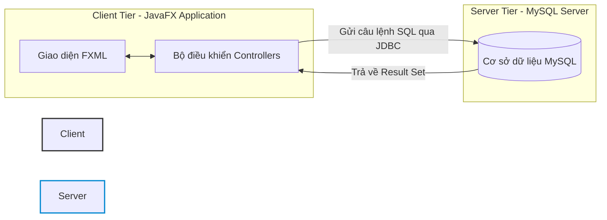
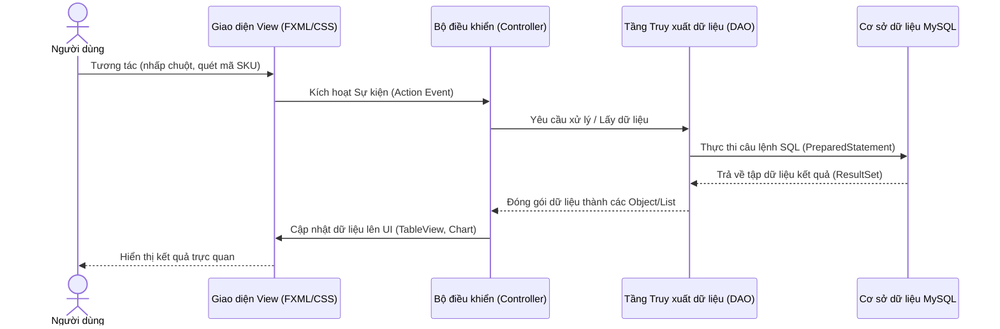

# CƠ SỞ LÝ THUYẾT VÀ CÔNG NGHỆ SỬ DỤNG

Một phần không thể thiếu trong báo cáo đồ án chính là cơ sở lý thuyết và công nghệ sử dụng. Chương này trình bày chi tiết về nền tảng lý thuyết hệ thống, các kiến trúc phần mềm được áp dụng, các thuật toán bảo mật và tập hợp các công nghệ, framework, thư viện được lựa chọn để phát triển ứng dụng quản lý cửa hàng bán giày **SoleManager**.

---

## 1.1. CÁC MÔ HÌNH KIẾN TRÚC HỆ THỐNG

### 1.1.1. Mô hình Client - Server (Khách - Chủ)

Hệ thống **SoleManager** được xây dựng dựa trên kiến trúc **Client - Server** hai lớp (2-Tier Architecture) truyền thống dành cho ứng dụng quản lý doanh nghiệp vừa và nhỏ chạy trong mạng nội bộ (LAN):

*   **Client (Phía máy khách)**: Là ứng dụng desktop viết bằng JavaFX chạy trực tiếp trên máy tính của nhân viên bán hàng hoặc người quản lý. Client chịu trách nhiệm tiếp nhận tương tác từ người dùng, xử lý logic giao diện hiển thị (UI/UX) và gửi các yêu cầu truy vấn thông qua giao thức kết nối JDBC.
*   **Server (Phía máy chủ)**: Là hệ quản trị cơ sở dữ liệu quan hệ **MySQL Server** chạy tập trung trên một máy chủ nội bộ hoặc Cloud. Server chịu trách nhiệm quản lý, lưu trữ, tối ưu hóa truy vấn dữ liệu và thực thi các nghiệp vụ bảo toàn dữ liệu bằng Triggers và Constraints.



> [!NOTE]
> Mô hình Client - Server giúp dữ liệu của cửa hàng được đồng bộ hóa tập trung. Khi nhân viên bán hàng tại quầy thực hiện thanh toán, số lượng sản phẩm lập tức được cập nhật trên database server, giúp người quản lý tại văn phòng có thể theo dõi doanh thu thời gian thực trên màn hình Dashboard mà không có độ trễ.

---

### 1.1.2. Mô hình MVC (Model - View - Controller)

Để tách biệt rõ ràng các thành phần giao diện, xử lý nghiệp vụ và thao tác dữ liệu, ứng dụng sử dụng mô hình thiết kế **MVC** chuẩn kết hợp mẫu thiết kế **DAO (Data Access Object)**:

*   **Model (Lớp Dữ liệu & Đối tượng)**: 
    *   Bao gồm các lớp thực thể (Entity/POJO) như `Product`, `Order`, `Customer`, `User` để đóng gói dữ liệu trong bộ nhớ.
    *   Tích hợp lớp **DAO (Data Access Object)** (như `ProductDAO`, `OrderDAO`, `CustomerDAO`) đóng vai trò là giao diện trung gian chịu trách nhiệm giao tiếp trực tiếp với cơ sở dữ liệu bằng các câu lệnh SQL.
*   **View (Lớp Giao diện)**:
    *   Sử dụng mã **FXML** (một định dạng dựa trên XML của JavaFX) để định nghĩa cấu trúc phân cấp cây Node của giao diện đồ họa.
    *   Sử dụng các tệp **CSS** (như `Style.css` và `SoleManager.css`) để định dạng thẩm mỹ (màu sắc, phông chữ, hiệu ứng chuyển động, phong cách Glassmorphism).
*   **Controller (Lớp Điều khiển)**:
    *   Các lớp Java Controller (như `DashboardController`, `SaleController`, `ProductController`) kế thừa hoặc liên kết với tệp FXML.
    *   Controller đóng vai trò trung gian tiếp nhận sự kiện (Event) từ View (khi click nút, quét mã vạch, chọn ngày), gọi các lớp nghiệp vụ tương ứng ở tầng Model/DAO để xử lý dữ liệu và cập nhật dữ liệu phản hồi lại màn hình View.



---

## 1.2. CÁC PHƯƠNG PHÁP, THUẬT TOÁN VÀ LÝ THUYẾT HỖ TRỢ NGHIỆP VỤ

### 1.2.1. Giao dịch Cơ sở dữ liệu (Database Transaction & Thuộc tính ACID)

Trong quản lý bán lẻ và kho hàng, tính nhất quán dữ liệu là yêu cầu sống còn. Khi một hành động nghiệp vụ đòi hỏi ghi nhận thông tin vào nhiều bảng dữ liệu khác nhau, ta phải sử dụng **Database Transaction**.

Ví dụ, khi thực hiện **nhập sản phẩm mới tích hợp nhập kho**, hệ thống phải thực hiện 3 thao tác:
1.  Chèn thông tin sản phẩm mới vào bảng `products`.
2.  Tạo một phiếu nhập kho trong bảng `import_orders`.
3.  Tạo chi tiết phiếu nhập trong bảng `import_details`.

Nếu bước 1 thành công nhưng bước 2 hoặc bước 3 thất bại (ví dụ mất kết nối mạng đột ngột), dữ liệu sẽ bị rơi vào trạng thái mồ côi (có sản phẩm nhưng không rõ nguồn gốc và nhà cung cấp). Để ngăn ngừa điều này, hệ thống áp dụng cơ chế quản lý giao dịch tuân thủ nghiêm ngặt **ACID**:

*   **Atomicity (Tính nguyên tử)**: Tất cả các câu lệnh SQL trong khối giao dịch phải thực thi thành công hoàn toàn. Nếu có bất kỳ câu lệnh nào lỗi, toàn bộ tiến trình sẽ bị hủy bỏ và phục hồi lại trạng thái ban đầu thông qua thao tác **Rollback**.
*   **Consistency (Tính nhất quán)**: Giao dịch đảm bảo đưa cơ sở dữ liệu từ trạng thái hợp lệ này sang trạng thái hợp lệ khác, tôn trọng tất cả các ràng buộc khóa ngoại và ràng buộc kiểm tra.
*   **Isolation (Tính cô lập)**: Các giao dịch chạy song song không được can thiệp lẫn nhau.
*   **Durability (Tính bền vững)**: Một khi giao dịch đã được **Commit**, dữ liệu sẽ được lưu trữ vĩnh viễn trong MySQL và không bị mất ngay cả khi hệ thống gặp sự cố mất điện.

```java
// Minh họa cấu trúc Transaction an toàn trong mã nguồn Java JDBC của SoleManager
Connection connection = DatabaseConnection.getConnection();
try {
    // 1. Tắt chế độ tự động lưu (AutoCommit)
    connection.setAutoCommit(false);

    // 2. Thực thi thêm sản phẩm mới
    productDAO.insert(product, connection);

    // 3. Thực thi thêm phiếu nhập kho
    importOrderDAO.insert(importOrder, connection);

    // 4. Thực thi thêm chi tiết phiếu nhập
    importDetailDAO.insert(importDetail, connection);

    // 5. Nếu tất cả thành công, tiến hành lưu vĩnh viễn dữ liệu
    connection.commit();
} catch (SQLException e) {
    // 6. Nếu xảy ra bất kỳ lỗi gì, khôi phục lại cơ sở dữ liệu về ban đầu
    if (connection != null) {
        connection.rollback();
    }
    throw e;
} finally {
    // 7. Khôi phục lại trạng thái mặc định của kết nối
    connection.setAutoCommit(true);
}
```

---

### 1.2.2. Cơ chế Trigger tự động xử lý tồn kho ở tầng Cơ sở dữ liệu

Thay vì thực hiện các phép toán cộng trừ số lượng tồn kho phức tạp bằng mã nguồn ứng dụng Java trên Client (dễ dẫn đến lỗi tranh chấp dữ liệu khi nhiều máy cùng bán một lúc), hệ thống chuyển giao trách nhiệm này cho tầng CSDL xử lý thông qua các **Triggers**.

*   **Trừ kho khi bán hàng**: Cài đặt trigger `AFTER INSERT ON order_details`. Ngay sau khi một chi tiết hóa đơn mới được thêm vào, trigger tự động trừ số lượng tương ứng trong bảng biến thể sản phẩm `product_variants`.
*   **Cộng kho khi nhập hàng**: Cài đặt trigger `AFTER INSERT ON import_details`. Tự động cộng số lượng giày vào kho khi phát sinh chi tiết phiếu nhập hàng mới.
*   **Ghi nhật ký biến động kho (Audit Log)**: Cài đặt các trigger tự động ghi nhận số lượng cũ, số lượng mới và lý do thay đổi (bán hàng - `'SALE'`, nhập hàng - `'IMPORT'`) vào bảng `inventory_logs`.

> [!TIP]
> Việc sử dụng Trigger giúp giải phóng tài nguyên xử lý của Client, giảm tải lưu lượng đường truyền mạng và đảm bảo tuyệt đối tính toàn vẹn dữ liệu tồn kho, bất kể giao dịch được thực hiện từ ứng dụng JavaFX hay trực tiếp từ một công cụ quản lý cơ sở dữ liệu khác.

---

### 1.2.3. Thuật toán Mã hóa Bảo mật SHA-256

Để bảo vệ thông tin mật khẩu của nhân viên và quản lý tránh khỏi rủi ro lộ lọt thông tin khi cơ sở dữ liệu bị truy cập trái phép, hệ thống áp dụng thuật toán băm mật mã học **SHA-256 (Secure Hash Algorithm 256-bit)**.

$$\text{Password\_Hashed} = \text{SHA-256}(\text{Password\_Input})$$

*   **Tính chất một chiều (One-way Hash)**: Không tồn tại thuật toán đảo ngược để tìm lại mật khẩu gốc từ chuỗi băm 64 ký tự hex.
*   **Không trùng lặp (Collision Resistance)**: Cực kỳ khó để tìm thấy hai mật khẩu khác nhau có cùng một chuỗi băm kết quả.
*   **Hiệu ứng thác đổ (Avalanche Effect)**: Chỉ cần thay đổi một ký tự rất nhỏ trong mật khẩu (ví dụ viết hoa một chữ cái), toàn bộ chuỗi băm SHA-256 đầu ra sẽ thay đổi hoàn toàn.

---

### 1.2.4. Giao thức Khôi phục Mật khẩu qua OTP và SMTP

Để giải quyết vấn đề quên mật khẩu an toàn mà không cần quản trị viên phải can thiệp thủ công, ứng dụng triển khai quy trình xác thực hai bước sử dụng **OTP (One-Time Password)** thông qua giao thức gửi thư điện tử **SMTP (Simple Mail Transfer Protocol)**:

```
[Nhập Email nhân viên]
         |
         v
(Kiểm tra sự tồn tại trong CSDL) -- Không tìm thấy --> [Báo lỗi Email không tồn tại]
         |
     Tìm thấy
         v
[Tự động tạo mã số ngẫu nhiên 6 chữ số (OTP)]
         |
         v
[Gửi Email xác thực bằng JavaMail API qua SMTP Gmail]
         |
         v
[Nhân viên nhập mã OTP đối khớp]
         |
         v
[Cho phép đặt mật khẩu mới (Băm SHA-256 trước khi lưu)]
```

---

## 1.3. CÁC CÔNG NGHỆ, FRAMEWORK VÀ THƯ VIỆN SỬ DỤNG

Hệ thống **SoleManager** được phát triển trên nền tảng các công nghệ mạnh mẽ, có độ ổn định và tính bảo mật cao:

| Phân loại | Tên công nghệ / Thư viện | Phiên bản | Lý do lựa chọn và vai trò trong hệ thống |
| :--- | :--- | :--- | :--- |
| **Core** | Java SE (LTS) | 17 | Ngôn ngữ lập trình hướng đối tượng mạnh mẽ, biên dịch mã nguồn tối ưu, quản lý bộ nhớ thông minh (Garbage Collector) và đa nền tảng (Write Once, Run Anywhere). |
| **Framework UI** | JavaFX | 21.0.1 | Framework phát triển ứng dụng Client hiện đại của Java, thay thế cho Java Swing cũ. Hỗ trợ tăng tốc phần cứng, dựng layout bằng XML (FXML) và định kiểu bằng CSS rất linh hoạt. |
| **CSDL** | MySQL | 8.0.33 | Hệ quản trị cơ sở dữ liệu quan hệ mã nguồn mở phổ biến nhất. Xử lý truy vấn cực nhanh, hỗ trợ transaction ACID đầy đủ, định nghĩa trigger và thủ tục lưu trữ mạnh mẽ. |
| **Tệp tin PDF** | iText PDF | 5.5.13.3 | Thư viện hàng đầu cho Java dùng để tạo lập, chỉnh sửa tài liệu PDF. Sử dụng để xuất hóa đơn bán hàng tức thì tại quầy bán hàng POS. |
| **Tệp tin Excel** | Apache POI | 5.2.3 | Thư viện của Apache Software Foundation dùng để đọc ghi tài liệu Microsoft Office. Dùng để kết xuất các báo cáo thống kê doanh số phức tạp ra file Excel dạng `.xlsx`. |
| **Gửi Mail** | JavaMail API | 1.6.2 | Thư viện cung cấp các giao thức Mail chuẩn (SMTP, IMAP, POP3) giúp ứng dụng gửi thư điện tử xác thực OTP đến tài khoản Gmail của nhân viên. |
| **Quản lý dự án**| Apache Maven | 3.x | Công cụ quản lý dự án và tự động tải/quản lý các thư viện phụ thuộc (Dependencies) tập trung thông qua tệp cấu hình `pom.xml`. |

### 1.3.1. JavaFX và thiết kế giao diện Declarative qua FXML

Khác với mô hình viết giao diện cứng bằng mã nguồn (Imperative) như Java Swing, JavaFX hỗ trợ lập trình giao diện theo mô hình khai báo (Declarative) thông qua các tệp **FXML**:

*   **Tách biệt thiết kế và mã nguồn**: Nhà phát triển có thể thiết kế giao diện một cách trực quan trên phần mềm **JavaFX Scene Builder**, phần mềm sẽ tự động sinh ra mã XML (`.fxml`). Lập trình viên chỉ tập trung viết mã xử lý sự kiện trong lớp Controller.
*   **Tùy biến bằng CSS (JavaFX CSS)**: JavaFX hỗ trợ một tập hợp con của tiêu chuẩn CSS3. Điều này cho phép áp dụng các thuộc tính đồ họa cao cấp như bo góc (`-fx-background-radius`), đổ bóng (`-fx-effect`), màu chuyển sắc Gradient (`linear-gradient`) giúp giao diện SoleManager đạt chuẩn thẩm mỹ **Glassmorphism** sang trọng, hiện đại.

### 1.3.2. Ưu thế của MySQL 8.0 đối với bài toán kinh doanh bán lẻ

Hệ thống chọn **MySQL 8.0** thay vì các cơ sở dữ liệu NoSQL (như MongoDB) vì:
*   **Tính toàn vẹn tham chiếu**: Mối quan hệ chặt chẽ giữa các bảng dữ liệu (Khách hàng - Hóa đơn - Chi tiết hóa đơn - Sản phẩm) được ràng buộc bằng các khóa ngoại (`FOREIGN KEY`). MySQL sẽ tự động ngăn chặn các hành động xóa nhà cung cấp hay danh mục nếu còn tồn tại sản phẩm liên kết, ngăn lỗi mất dữ liệu nghiêm trọng.
*   **Tối ưu hóa Index**: MySQL hỗ trợ đánh chỉ mục (B-Tree Index) trên các trường dữ liệu tra cứu tần suất cao như `product_code`, `phone` của khách hàng và mã hóa đơn, giúp tốc độ lọc dữ liệu bán hàng POS diễn ra tức thời (dưới 0.1 giây).

---

## 1.4. LÝ DO LỰA CHỌN PHƯƠNG ÁN CÔNG NGHỆ

Quyết định xây dựng ứng dụng **SoleManager** dưới dạng một **JavaFX Desktop Application** thay vì một **Web Application** (sử dụng React/ExpressJS) dựa trên các phân tích thực tế sau:

1.  **Độ trễ xử lý cực thấp (Zero-Latency POS)**: 
    Tại quầy bán hàng của các shop giày dép, tốc độ thanh toán là yếu tố then chốt. Ứng dụng Desktop chạy trực tiếp trên hệ điều hành, kết nối thẳng tới cơ sở dữ liệu trong mạng LAN có tốc độ phản hồi gần như bằng không. Không gặp hiện tượng tải trang hay nghẽn mạng như trình duyệt Web.
2.  **Khả năng tương thích thiết bị ngoại vi vượt trội**:
    Ứng dụng JavaFX chạy native trên Windows giúp dễ dàng bắt tín hiệu trực tiếp từ máy quét mã vạch vật lý qua cổng USB (Keyboard wedge) và tự động gọi lệnh in hóa đơn qua driver của máy in nhiệt mà không gặp rào cản bảo mật (sandbox) như các ứng dụng chạy trên trình duyệt web.
3.  **Bảo mật dữ liệu nội bộ**:
    Dữ liệu kinh doanh và khách hàng được lưu trữ hoàn toàn trong máy chủ mạng LAN nội bộ của cửa hàng. Phương án này tránh việc phơi bày các API ra Internet, giảm thiểu tối đa nguy cơ bị tấn công mạng (DDoS, Brute force API) và không đòi hỏi chi phí thuê máy chủ, duy trì tên miền, SSL đắt đỏ hàng năm.
