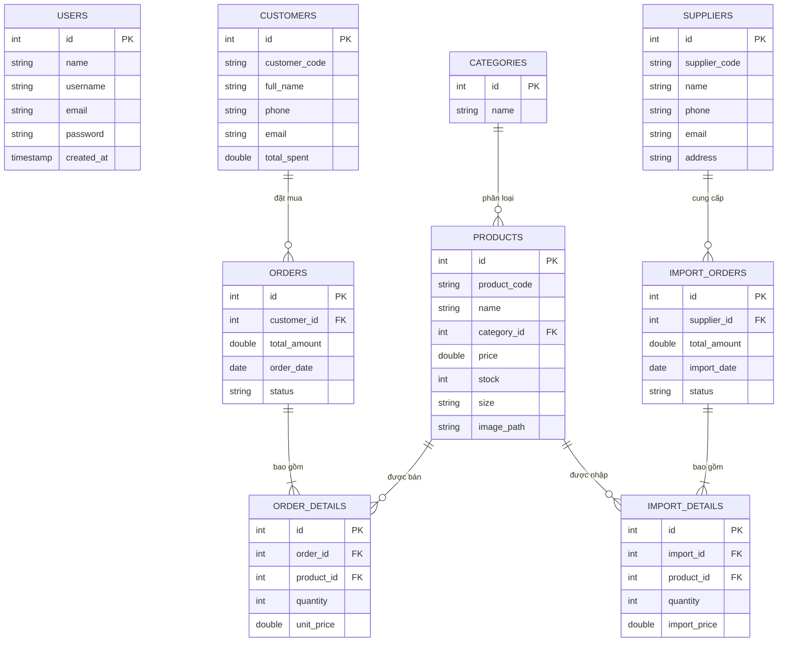

# 👟 Dự Án Hệ Thống Quản Lý Cửa Hàng Bán Giày - "SoleManager"

Chào mừng bạn đến với tài liệu tổng quan dự án **SoleManager** (Quản lý Cửa hàng Bán giày). Đây là một ứng dụng máy để bàn (Desktop Application) hoàn chỉnh, được xây dựng dựa trên công nghệ hiện đại, cấu trúc mã nguồn phân lớp rõ ràng, giao diện người dùng (UI) tinh tế và các nghiệp vụ quản lý bán hàng thực tế chuyên nghiệp.

Tài liệu này mô tả chi tiết toàn bộ các thành phần công nghệ, chức năng, giao diện, logic nghiệp vụ hiện có và gợi ý các hướng phát triển nâng cấp trong tương lai của dự án.

---

## 📌 1. Tổng Quan Kiến Trúc & Công Nghệ

### 🛠️ Công nghệ cốt lõi
*   **Ngôn ngữ lập trình**: Java 17 (cung cấp hiệu năng và các tính năng hướng đối tượng mạnh mẽ).
*   **Giao diện đồ họa (UI)**: JavaFX 21 (sử dụng bố cục FXML kết hợp với CSS tùy biến sâu).
*   **Hệ quản trị cơ sở dữ liệu**: MySQL 8.0 (CSDL quan hệ, đảm bảo tính nhất quán của dữ liệu qua các ràng buộc khóa ngoại).
*   **Quản lý dự án & thư viện**: Maven (cấu hình qua tệp [pom.xml](file:///d:/VKU/doancoso1/QuanLyBanGiay/pom.xml)).

### 📚 Các thư viện bên thứ ba tích hợp
1.  **MySQL Connector Java (8.0.33)**: Kết nối và thực thi các câu lệnh SQL từ Java đến hệ quản trị CSDL MySQL.
2.  **iText PDF (5.5.13.3)**: Tự động tạo và định dạng hóa đơn bán hàng chuyên nghiệp xuất ra tệp PDF.
3.  **JavaMail (javax.mail 1.6.2)**: Kết nối cổng SMTP của Gmail để tự động gửi mã OTP xác thực khôi phục mật khẩu.

### 📐 Kiến trúc mã nguồn (MVC + DAO Pattern)
Mã nguồn dự án được tổ chức khoa học trong thư mục [src](file:///d:/VKU/doancoso1/QuanLyBanGiay/src) theo mô hình phân lớp rõ ràng:
*   [models](file:///d:/VKU/doancoso1/QuanLyBanGiay/src/models): Định nghĩa các thực thể dữ liệu ánh xạ từ các bảng CSDL (`User`, `Product`, `Category`, `Customer`, `Order`, `OrderDetail`, `Supplier`, `ImportOrder`, `ImportDetail`).
*   [view](file:///d:/VKU/doancoso1/QuanLyBanGiay/src/view): Chứa các tệp giao diện XML (.fxml) định hình cấu trúc bố cục màn hình.
*   [controller](file:///d:/VKU/doancoso1/QuanLyBanGiay/src/controller): Chứa mã điều khiển liên kết giao diện với logic xử lý nghiệp vụ.
*   [DAO](file:///d:/VKU/doancoso1/QuanLyBanGiay/src/DAO): Lớp truy cập dữ liệu (Data Access Object), thực hiện các câu lệnh SQL an toàn (`PreparedStatement`) để tương tác với MySQL.
*   [database](file:///d:/VKU/doancoso1/QuanLyBanGiay/src/database): Chứa lớp quản lý kết nối CSDL tập trung [DBConnection.java](file:///d:/VKU/doancoso1/QuanLyBanGiay/src/database/DBConnection.java).
*   [utils](file:///d:/VKU/doancoso1/QuanLyBanGiay/src/utils): Các công cụ tiện ích dùng chung như [PDFGenerator.java](file:///d:/VKU/doancoso1/QuanLyBanGiay/src/utils/PDFGenerator.java) để tạo hóa đơn.
*   [resources](file:///d:/VKU/doancoso1/QuanLyBanGiay/src/resources): Lưu trữ tài nguyên của ứng dụng gồm tệp hình ảnh sản phẩm (`img/`) và các tệp phong cách giao diện (`css/SoleManager.css` và `css/Style.css`).

---

## 🗄️ 2. Sơ Đồ Cơ Sở Dữ Liệu (`testlogin`)

Cơ sở dữ liệu của dự án được cấu trúc hóa chặt chẽ với **9 bảng** quan hệ giúp quản lý đồng bộ từ tài khoản, sản phẩm, khách hàng đến hóa đơn bán hàng và phiếu nhập kho:

---

## 🖥️ 3. Chi Tiết Các Màn Kinh & Logic Nghiệp Vụ Hiện Có

Hệ thống sở hữu các tính năng nghiệp vụ hoàn chỉnh được thiết kế trực quan và lập trình logic tối ưu:

### 3.1. Hệ thống Xác Thực (Đăng nhập / Đăng ký / Quên mật khẩu)
*   **Giao diện**: Các màn hình thiết kế dạng Form nhập hiện đại, có các thông điệp phản hồi lỗi hoặc thành công trực quan.
*   **Logic xử lý**:
    *   **Bảo mật**: Mật khẩu được mã hóa một chiều bằng thuật toán băm bảo mật **SHA-256** trước khi so khớp đăng nhập hoặc lưu trữ vào cơ sở dữ liệu.
    *   **Quên mật khẩu chuyên nghiệp (3 Bước)**:
        1.  *Bước 1 (Nhập Email)*: Hệ thống kiểm tra xem email có tồn tại trên hệ thống không. Nếu có, tạo ngẫu nhiên mã OTP 6 chữ số và kích hoạt JavaMail gửi email thông báo mã OTP thực tế đến hòm thư của người dùng.
        2.  *Bước 2 (Xác thực OTP)*: Người dùng nhập mã nhận được trong email. Hệ thống tiến hành so khớp mã OTP tạm thời.
        3.  *Bước 3 (Đổi mật khẩu)*: Khi xác thực thành công, hệ thống cho phép nhập mật khẩu mới, tiến hành băm SHA-256 và cập nhật trực tiếp vào cơ sở dữ liệu.

### 3.2. Màn Hình Tổng Quan (Dashboard)
*   **Giao diện**: Bố cục Dashboard hiện đại gồm hệ thống các thẻ số liệu lớn (KPI Cards), biểu đồ miền trực quan và bảng danh sách giao dịch.
*   **Logic xử lý**:
    *   **Thống kê thời gian thực**:
        *   *Doanh thu hôm nay*: Tổng số tiền của các đơn hàng có ngày hiện tại (`CURDATE()`) và trạng thái khác `'Da huy'`.
        *   *Đơn hàng mới*: Số lượng đơn phát sinh trong ngày.
        *   *Tổng khách hàng*: Số lượng khách hàng đã lưu trong hệ thống.
        *   *Sản phẩm sắp hết hàng*: Đếm số lượng sản phẩm có tồn kho thấp ($0 < stock \le 10$).
    *   **Biểu đồ doanh thu 7 ngày (`AreaChart`)**: Truy vấn tính tổng tiền bán hàng được nhóm theo từng ngày trong 6 ngày vừa qua và hôm nay, tự động cập nhật biểu đồ miền dạng sóng mượt mà.
    *   **Sản phẩm bán chạy nhất (`Top 5 Products`)**: Thống kê danh sách 5 mẫu giày được bán nhiều nhất dựa trên tổng số lượng đặt hàng (`quantity`) từ bảng `order_details`, hiển thị tên sản phẩm, số lượng đôi đã bán và doanh thu thu về (được định dạng rút gọn tiện lợi như `15.5M` hay `800K`).
    *   **Giao dịch gần đây nhất (`Recent Transactions`)**: Hiển thị bảng 5 hóa đơn mới nhất với Mã đơn hiển thị định dạng đẹp (VD: `HD00005`), tên khách hàng (hoặc hiển thị mặc định `Khách lẻ` nếu không chọn khách), chuỗi gộp các sản phẩm đã mua, tổng số tiền và trạng thái đơn hàng.

### 3.3. Quản Lý Sản Phẩm & Tồn Kho (`Product.fxml`)
*   **Giao diện**: Danh sách sản phẩm dạng bảng biểu chuyên nghiệp. Tự động hiển thị hình ảnh thu nhỏ (`ImageView`) từ đường dẫn ảnh sản phẩm đã chọn hoặc hiển thị ký hiệu mặc định (`👟`) với màu sắc nền thẻ linh động theo nhóm danh mục của giày.
*   **Logic xử lý**:
    *   **Bộ lọc đa năng**: Lọc sản phẩm tức thì theo từ khóa nhập (Tên, SKU, Danh mục) kết hợp lọc theo trạng thái kho hàng (*Tất cả*, *Còn hàng*, *Sắp hết* [tồn kho $\le 5$], *Hết hàng*).
    *   **Chỉ số kho nâng cao (Metrics)**: Tự động cập nhật các nhãn hiển thị tổng số dòng sản phẩm, số sản phẩm sắp hết hàng, tổng số lượng giày thực tế hiện có trong kho và **Tổng giá trị tồn kho** (bằng tổng $Price \times Stock$ của tất cả sản phẩm).
    *   **Hành động**:
        *   *Thêm / Sửa sản phẩm*: Mở cửa sổ Pop-up độc lập (`AddProduct.fxml`, `EditProduct.fxml`) nhập liệu các thông tin như tên, danh mục, kích cỡ, đơn giá, số lượng tồn kho và chọn tệp ảnh thực tế trên máy tính để lưu trữ đường dẫn.
        *   *Xóa sản phẩm*: Thực hiện kiểm tra ràng buộc trước khi xóa. Nếu mã sản phẩm đã từng phát sinh hóa đơn bán hàng trong CSDL, hệ thống sẽ ngăn chặn và đưa ra cảnh báo lỗi thay vị để ứng dụng bị crash do xung đột khóa ngoại.

### 3.4. Giao Diện Bán Hàng POS (`Sale.fxml`) - Module Trung Tâm
Đây là phân hệ tinh vi và tối ưu nhất của ứng dụng, mang lại trải nghiệm thao tác siêu tốc tại quầy cho nhân viên thu ngân:
*   **Giao diện**: Thiết kế chia 3 phần rõ rệt: Lưới lọc & bảng sản phẩm bên trái; Thông tin khách hàng và giỏ hàng bên phải; Phương thức thanh toán và nút chức năng dưới cùng.
*   **Logic xử lý**:
    *   **Thêm vào giỏ hàng thông minh**: Khi nhấn nút `+` trên sản phẩm, hệ thống tự động kiểm tra lượng tồn kho. Nếu số lượng trong giỏ hàng đã bằng tồn kho thực tế, hệ thống sẽ cảnh báo và vô hiệu hóa nút thêm để tránh tình trạng bán quá số lượng có sẵn.
    *   **Điều chỉnh số lượng trong giỏ hàng**: Cho phép tăng/giảm trực tiếp số lượng từng dòng trong giỏ hàng, tự động tính toán lại tổng tiền tạm tính và tổng thanh toán.
    *   **Gợi ý tìm kiếm khách hàng nhanh**: Khi nhân viên gõ tên hoặc số điện thoại tại ô tìm kiếm khách hàng, hệ thống tự động đưa ra các dòng gợi ý trên một `ListView` nổi bên dưới. Chỉ cần click chọn là thông tin khách hàng lập tức được liên kết vào hóa đơn.
    *   **Thêm nhanh khách hàng mới**: Có nút thêm nhanh khách hàng ngay tại màn hình bán hàng qua một Dialog form nổi, hỗ trợ lưu trực tiếp thông tin khách hàng vào cơ sở dữ liệu MySQL và chọn ngay khách hàng đó vào đơn hàng đang bán mà không cần chuyển trang.
    *   **Thanh toán và Tự Động Sinh Hóa Đơn PDF**: 
        *   Khi nhấn "Thanh toán", hệ thống tiến hành kiểm tra giỏ hàng, gọi DAO thực hiện lưu thông tin hóa đơn mới vào bảng `orders`, chi tiết hóa đơn vào `order_details`, và đồng thời tự động cập nhật trừ đi số lượng tồn kho tương ứng của các sản phẩm đã bán trong bảng `products`.
        *   Nếu thanh toán thành công, hệ thống đưa ra hộp thoại hỏi người dùng có muốn in hóa đơn không. Nếu nhấn "Có", thư viện `iText PDF` sẽ tự động tạo file hóa đơn PDF chuyên nghiệp (đầy đủ thông tin: Mã hóa đơn, khách hàng, phương thức thanh toán, chi tiết các món, tổng tiền) lưu vào thư mục `invoices/` của dự án và kích hoạt ứng dụng đọc PDF mặc định trên hệ điều hành mở trực tiếp file lên cho nhân viên in ấn.

### 3.5. Nhập Kho Sản Phẩm (`Import.fxml`)
*   **Giao diện**: Kết hợp danh sách sản phẩm dạng thẻ (Grid Cards) trực quan bên trái và bảng danh sách phiếu nhập cùng khu vực chọn nhà cung cấp bên phải.
*   **Logic xử lý**:
    *   **Grid sản phẩm động**: Hiển thị lưới các thẻ sản phẩm đẹp mắt, cho phép tìm kiếm nhanh và lọc sản phẩm theo từng danh mục để nhân viên dễ dàng chọn sản phẩm cần nhập vào kho.
    *   **Chỉnh sửa trực tiếp trên bảng (Editable Table)**: Bảng phiếu nhập cho phép nhân viên nhấp đúp và nhập trực tiếp số lượng nhập (`Quantity`) và đơn giá nhập (`Import Price`) của từng sản phẩm ngay trên các ô của TableView. Hệ thống tự động tính toán tổng tiền phiếu nhập thời gian thực.
    *   **Xử lý lưu trữ phiếu nhập**: Lưu thông tin phiếu nhập vào bảng `import_orders`, chi tiết phiếu nhập vào `import_details` và tiến hành **cộng thêm** trực tiếp số lượng vừa nhập vào số lượng tồn kho hiện tại của các sản phẩm tương ứng trong bảng `products` trong CSDL, giúp đảm bảo số liệu kho luôn chính xác.

### 3.6. Quản Lý Đơn Hàng & Lịch Sử Hóa Đơn (`Order.fxml`)
*   **Giao diện**: Bảng lịch sử toàn bộ các hóa đơn đã giao dịch của cửa hàng kèm các nhãn màu phân loại hình thức thanh toán (Tiền mặt, Chuyển khoản, Thẻ Visa/MC) và trạng thái đơn hàng (Đã thanh toán / Đã hủy).
*   **Logic xử lý**:
    *   **Tìm kiếm & Thống kê**: Hỗ trợ tìm kiếm đơn nhanh theo mã hóa đơn, tên khách hàng, số điện thoại và lọc theo hình thức thanh toán. Thống kê nhanh tổng doanh thu bán hàng mọi thời đại.
    *   **Xem chi tiết hóa đơn**: Khi chọn xem chi tiết một đơn hàng, hệ thống sẽ hiển thị một Dialog thông tin khách hàng và bảng chi tiết các sản phẩm đã bán trong đơn hàng đó (lấy từ bảng `order_details` kết hợp thông tin sản phẩm).
    *   **Logic hoàn trả tồn kho khi Hủy Đơn**: Đây là tính năng nghiệp vụ rất quan trọng. Khi người dùng xác nhận hủy một đơn hàng có trạng thái "Đã thanh toán", hệ thống sẽ chuyển đổi trạng thái của đơn hàng đó thành `'Da huy'` trong CSDL và đồng thời tự động lấy thông tin số lượng mua của từng sản phẩm trong đơn hàng đó để **cộng ngược lại** vào tồn kho tương ứng của sản phẩm đó trong bảng `products`, giúp khôi phục số lượng kho chính xác của cửa hàng.

---

## 🎨 4. Đánh Giá Thiết Kế Giao Diện & Trải Nghiệm (UI/UX)

Dự án sở hữu phong cách thiết kế giao diện cực kỳ ấn tượng, chuyên nghiệp và vượt trội hơn hẳn các ứng dụng JavaFX thông thường nhờ:
1.  **Phối màu hài hòa hiện đại**: Sử dụng bảng màu tinh tế (Curated Palette) với tông màu sáng nền trắng kết hợp xám nhạt, các màu nhấn trạng thái nổi bật như xanh lục cho thành công/đã thanh toán, vàng cam cho cảnh báo/sắp hết hàng và đỏ cho hủy bỏ/hết hàng.
2.  **Định hình phong cách qua CSS tùy biến sâu**:
    *   Các thành phần nút bấm (Button), ô nhập liệu (TextField), hộp chọn (ComboBox) đều được thiết kế bo tròn góc mềm mại (`-fx-background-radius`), bổ sung hiệu ứng đổ bóng mờ (`dropshadow`) tạo chiều sâu lập thể.
    *   Sử dụng hiệu ứng chuyển đổi trạng thái (hover effects) khi người dùng di chuột qua các nút, tạo cảm giác giao diện "sống động" và phản hồi mượt mà với người dùng.
    *   Sử dụng các nhãn tag trạng thái (Pills) thay vì văn bản thô giúp tăng khả năng nhận diện thông tin nhanh.
3.  **Tối ưu trải nghiệm sử dụng (UX)**:
    *   Bảng biểu (`TableView`) có cơ chế tự động co giãn các cột (`CONSTRAINED_RESIZE_POLICY`) vừa vặn với kích thước màn hình, chiều cao hàng được cố định đồng đều tạo sự ngăn nắp.
    *   Tránh các thao tác thừa: Cho phép tìm kiếm gõ phím tức thì (real-time filtering), thao tác trực tiếp trên các dòng bảng (inline editing), hỗ trợ ListView gợi ý thông minh giúp giảm tối đa thời gian nhập liệu cho nhân viên.

---

## 🚀 5. Các Đề Xuất Nâng Cấp & Hướng Phát Triển Mở Rộng

Để đưa hệ thống **SoleManager** trở thành một sản phẩm thương mại hoàn thiện và cao cấp hơn nữa, dưới đây là những tính năng rất tiềm năng có thể bổ sung vào dự án:

### 5.1. Phân Quyền Người Dùng (Role-Based Access Control)
*   **Hiện trạng**: Mọi tài khoản trong bảng `users` đều có quyền hạn như nhau khi đăng nhập vào hệ thống.
*   **Đề xuất**: 
    *   Thêm trường `role` (Admin / Nhân viên) trong bảng `users`.
    *   Khi nhân viên bán hàng đăng nhập, hệ thống sẽ ẩn đi hoặc vô hiệu hóa các tab nhạy cảm như *Dashboard* (thống kê doanh thu), *Nhập kho* (Import), và *Quản lý sản phẩm* (Product CRUD). Nhân viên chỉ được thao tác tại tab *Bán hàng* (POS) và xem danh sách hóa đơn lịch sử bán hàng của chính họ.

### 5.2. Quản Lý Danh Mục & Nhà Cung Cấp Chuyên Sâu
*   **Hiện trạng**: Danh mục (`Category`) và Nhà cung cấp (`Supplier`) đã được thiết lập bảng CSDL và lớp DAO nhưng chưa có các màn hình quản lý trực quan riêng biệt.
*   **Đề xuất**:
    *   Xây dựng thêm 2 tab quản lý riêng biệt cho Danh mục sản phẩm và Nhà cung cấp để Admin có thể dễ dàng quản lý thông tin liên hệ của đối tác, thêm mới danh mục giày trực quan thay vì phải thao tác trong các Dialog nhỏ.

### 5.3. Báo Cáo Tài Chỉ & Phân Tích Chuyên Sâu (Reports & Analytics)
*   **Hiện trạng**: Nút "Báo cáo" (btnReports) trên thanh điều hướng sidebar hiện tại đang ở trạng thái chờ phát triển (`Tab not implemented yet`).
*   **Đề xuất**:
    *   Kích hoạt tab này để xây dựng giao diện thống kê doanh số chuyên sâu.
    *   Cho phép lọc doanh thu, chi phí nhập hàng, và lợi nhuận gộp theo khoảng thời gian tùy chọn (ngày bắt đầu - ngày kết thúc), theo tháng hoặc theo năm.
    *   Tích hợp thêm biểu đồ hình tròn phân tích cơ cấu doanh số bán ra theo từng nhóm danh mục giày (thể thao, công sở, sandal...).
    *   Tích hợp thư viện **Apache POI** để hỗ trợ tính năng "Xuất Excel" các báo cáo tài chính, báo cáo tồn kho hoặc danh sách hóa đơn để gửi cho ban quản trị.

### 5.4. Tích Hợp Quét Mã Vạch & Mã QR (Barcode & QR Code Integration)
*   **Hiện trạng**: Nhân viên bán hàng vẫn đang phải gõ từ khóa tìm kiếm tên sản phẩm hoặc mã SKU thủ công trên màn hình POS.
*   **Đề xuất**:
    *   Tích hợp chức năng lắng nghe sự kiện từ cổng USB kết nối máy quét mã vạch (Barcode Scanner).
    *   Nhân viên chỉ cần đưa hộp giày có dán nhãn mã vạch qua máy quét, hệ thống sẽ tự động tìm kiếm và lập tức thêm sản phẩm đó vào giỏ hàng POS với số lượng cộng 1, giúp đẩy nhanh tốc độ thanh toán lên gấp nhiều lần.

### 5.5. Quản Lý Lịch Sử Phiếu Nhập Kho
*   **Hiện trạng**: Phiếu nhập kho đã được lưu trữ trong CSDL khi thực hiện chức năng Nhập kho, nhưng chưa có giao diện hiển thị lịch sử các phiếu nhập này.
*   **Đề xuất**:
    *   Xây dựng giao diện danh sách Phiếu nhập tương tự như giao diện Lịch sử đơn hàng bán.
    *   Cho phép xem chi tiết từng phiếu nhập xem ngày hôm đó đã nhập những mẫu giày nào, số lượng bao nhiêu, từ nhà cung cấp nào và tổng số tiền đã thanh toán cho nhà cung cấp là bao nhiêu để tiện đối soát tài chính.
