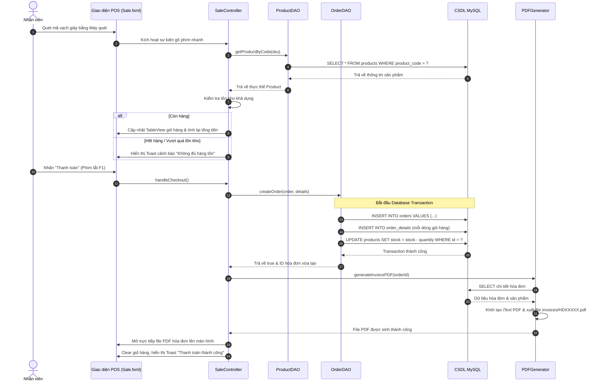
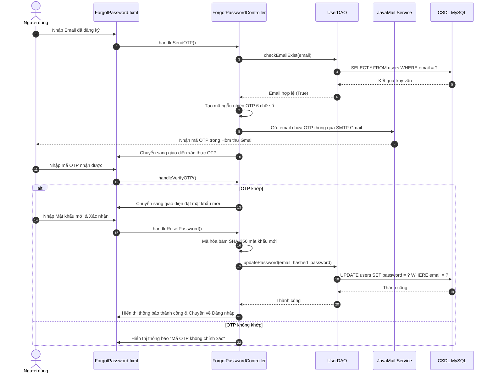
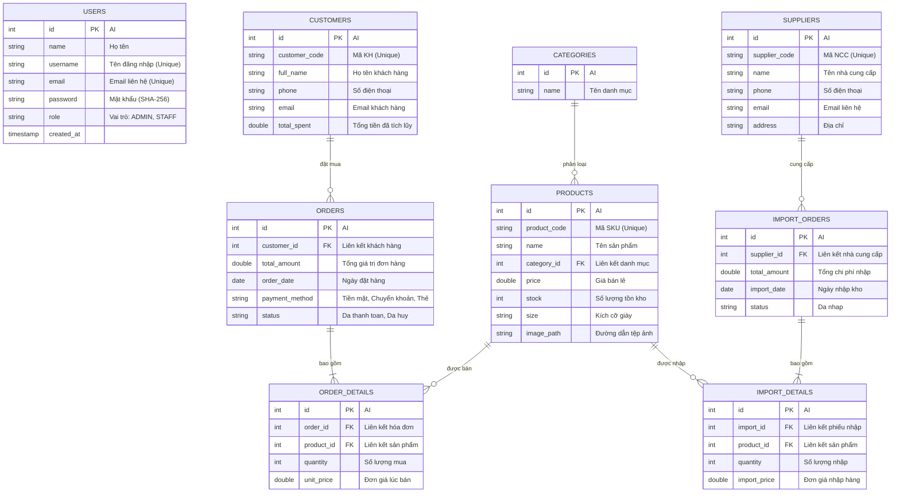

# 📊 BÁO CÁO PHÂN TÍCH VÀ THIẾT KẾ HỆ THỐNG SOLEMANAGER
## 👟 HỆ THỐNG QUẢN LÝ CỬA HÀNG BÁN GIÀY - SOLEMANAGER
---

## 📂 MỤC LỤC
1. [GIỚI THIỆU CHUNG DỰ ÁN](#1-gioi-thieu-chung)
2. [YÊU CẦU HỆ THỐNG (SYSTEM REQUIREMENTS)](#2-yeu-cau-he-thong)
   * 2.1. [Yêu Cầu Chức Năng (Functional Requirements)](#21-yeu-cau-chuc-nang)
   * 2.2. [Yêu Cầu Phi Chức Năng (Non-functional Requirements)](#22-yeu-cau-phi-chuc-nang)
3. [PHÂN TÍCH HỆ THỐNG VỚI UML (USE CASE & SEQUENCE DIAGRAM)](#3-phan-tich-he-thong-uml)
   * 3.1. [Biểu Đồ Use Case (Use Case Diagram)](#31-bieu-do-use-case)
   * 3.2. [Biểu Đồ Tuần Tự POS Bán Hàng (Payment Sequence Diagram)](#32-bieu-do-tuan-tu-pos)
   * 3.3. [Biểu Đồ Tuần Tự Quên Mật Khẩu (OTP Verification Sequence Diagram)](#33-bieu-do-tuan-tu-otp)
4. [THIẾT KẾ CƠ SỞ DỮ LIỆU (DATABASE DESIGN)](#4-thiet-ke-csdl)
   * 4.1. [Sơ Đồ Thực Thể Liên Kết (ERD)](#41-so-do-erd)
   * 4.2. [Chi Tiết Cấu Trúc Các Bảng (Data Dictionary)](#42-chi-tiet-cac-bang)
5. [KIẾN TRÚC PHẦN MỀM & THIẾT KẾ LỚP (SOFTWARE ARCHITECTURE & CLASS DESIGN)](#5-kien-truc-phan-mem)
   * 5.1. [Mô Hình MVC + DAO Pattern](#51-mo-hinh-mvc-dao)
   * 5.2. [Sơ Đồ Tổ Chức Thư Mục Nguồn](#52-so-do-to-chuc-thu-muc)
6. [CHI TIẾT THIẾT KẾ CÁC NGHIỆP VỤ TRỌNG TÂM](#6-chi-tiet-nghiep-vu)
   * 6.1. [Module POS Bán Hàng & In Hóa Đơn PDF Tự Động](#61-pos-in-hoa-don)
   * 6.2. [Quy Trình Nhập Kho Tích Hợp (Atomic Transaction)](#62-quy-trinh-nhap-kho)
   * 6.3. [Hủy Đơn Hàng & Khôi Phục Tồn Kho Tự Động](#63-huy-don-khoi-phuc-kho)
   * 6.4. [Báo Cáo Tài Chính & Xuất Excel (Apache POI)](#64-bao-cao-tai-chinh)
7. [CÔNG NGHỆ & MÔI TRƯỜNG TRIỂN KHAI](#7-cong-nghe-trien-khai)

---

<a name="1-gioi-thieu-chung"></a>
## 📌 1. GIỚI THIỆU CHUNG DỰ ÁN

**SoleManager** là một ứng dụng máy để bàn (Desktop Application) toàn diện được thiết kế để giải quyết bài toán quản lý kinh doanh, bán hàng, nhập kho và báo cáo doanh số cho các cửa hàng bán lẻ giày dép. Hệ thống hướng đến mục tiêu tối ưu hóa trải nghiệm bán hàng tại quầy (POS), quản lý chính xác tồn kho theo thời gian thực và cung cấp dữ liệu phân tích tài chính trực quan cho nhà quản trị.

### Đối tượng sử dụng hệ thống:
1. **Người Quản Trị (Admin):** Có toàn quyền kiểm soát hệ thống, theo dõi doanh số, quản lý sản phẩm, danh mục, nhà cung cấp, nhập kho, phân quyền và xuất báo cáo tài chính.
2. **Nhân Viên Bán Hàng (Staff):** Thực hiện nghiệp vụ bán hàng POS tại quầy, quản lý thông tin khách hàng và tạo hóa đơn thanh toán cho khách.

---

<a name="2-yeu-cau-he-thong"></a>
## 📋 2. YÊU CẦU HỆ THỐNG (SYSTEM REQUIREMENTS)

<a name="21-yeu-cau-chuc-nang"></a>
### 2.1. Yêu Cầu Chức Năng (Functional Requirements)

Hệ thống được chia làm 8 module chức năng chính:

| STT | Module | Mô tả chi tiết chức năng | Vai trò |
| :--- | :--- | :--- | :--- |
| **1** | **Xác thực hệ thống** | - Đăng nhập tài khoản bằng tên đăng nhập và mật khẩu.<br>- Đăng ký tài khoản mới.<br>- Khôi phục mật khẩu qua quy trình 3 bước xác thực OTP thực tế gửi qua email (sử dụng SMTP Gmail). | Admin / Staff |
| **2** | **Tổng quan (Dashboard)** | - Xem thẻ chỉ số KPI: Doanh thu ngày, Đơn hàng mới, Tổng khách hàng, Sản phẩm sắp hết.<br>- Biểu đồ miền (`AreaChart`) trực quan hóa doanh thu 7 ngày gần nhất.<br>- Bảng liệt kê 5 giao dịch mới nhất.<br>- Bảng vinh danh Top 5 sản phẩm bán chạy nhất kèm tổng doanh thu tương ứng. | Admin |
| **3** | **Bán hàng POS** | - Quét mã vạch (Barcode Scanner) bằng máy quét vật lý để tự động thêm sản phẩm vào giỏ hàng.<br>- Tìm kiếm sản phẩm real-time theo SKU, Tên, lọc theo Loại.<br>- Tự động kiểm tra số lượng tồn kho khi thêm/sửa giỏ hàng (ngăn bán quá số lượng có sẵn).<br>- Gợi ý tìm kiếm khách hàng bằng Tên/SĐT và chọn nhanh.<br>- Thêm nhanh khách hàng mới qua dialog nổi mà không cần thoát màn hình bán hàng.<br>- Tự động tính toán tổng tiền, chiết khấu, số tiền thực thu.<br>- Lưu hóa đơn vào DB, cập nhật trừ tồn kho và tự động xuất hóa đơn PDF mở ngay cho nhân viên in. | Staff (Admin có thể truy cập) |
| **4** | **Quản lý Sản phẩm & Kho** | - Quản lý danh sách giày: Tên, size, giá bán, đường dẫn ảnh, số lượng tồn kho.<br>- Cảnh báo tồn kho thấp (đổi màu đỏ cảnh báo).<br>- Lọc sản phẩm nhanh theo từ khóa và trạng thái kho (Còn hàng, Sắp hết, Hết hàng).<br>- Tính toán **Tổng giá trị tiền tồn kho** tự động ($Price \times Stock$).<br>- CRUD sản phẩm, ngăn xóa sản phẩm đã từng phát sinh hóa đơn bán hàng. | Admin |
| **5** | **Quản lý Lịch sử Nhập kho** | - Tích hợp khai báo Nhà cung cấp, Giá nhập, Số lượng tồn kho ban đầu trực tiếp khi thêm sản phẩm mới dưới dạng một **Transaction** CSDL an toàn.<br>- Hiển thị lịch sử các phiếu nhập kho.<br>- Xem chi tiết từng phiếu nhập (danh sách mặt hàng nhập, đơn giá, số lượng, thành tiền). | Admin |
| **6** | **Quản lý Danh mục & NCC** | - CRUD danh mục sản phẩm. Thống kê số lượng giày thuộc từng danh mục.<br>- CRUD nhà cung cấp kèm kiểm tra định dạng Số điện thoại (10 số bắt đầu bằng 0), Email chuẩn.<br>- Thống kê số lượng đơn nhập tương ứng với từng nhà cung cấp. | Admin |
| **7** | **Quản lý Đơn hàng** | - Tra cứu lịch sử hóa đơn bán lẻ của cửa hàng.<br>- Xem chi tiết đơn hàng (các sản phẩm đã mua, số lượng, giá bán).<br>- **Hủy đơn hàng**: Cập nhật trạng thái đơn hàng thành `'Da huy'` và **cộng ngược lại** toàn bộ số lượng sản phẩm của đơn hàng đó vào kho hàng. | Admin / Staff |
| **8** | **Báo cáo & Phân tích** | - Lọc dữ liệu theo khoảng thời gian (`Từ ngày` - `Đến ngày`).<br>- Thống kê doanh thu thực tế và ước tính lợi nhuận gộp.<br>- Biểu đồ đường (`LineChart`) thể hiện xu hướng doanh số theo thời gian.<br>- Biểu đồ tròn (`PieChart`) thể hiện cơ cấu doanh thu theo từng loại giày.<br>- Biểu đồ cột (`BarChart`) liệt kê Top 5 sản phẩm bán chạy nhất.<br>- **Xuất Excel (.xlsx)** báo cáo tài chính định dạng chuẩn chuyên nghiệp qua Apache POI. | Admin |

<a name="22-yeu-cau-phi-chuc-nang"></a>
### 2.2. Yêu Cầu Phi Chức Năng (Non-functional Requirements)

1.  **Bảo mật thông tin (Security):**
    *   Mật khẩu của người dùng bắt buộc phải được băm một chiều bằng thuật toán băm bảo mật **SHA-256** trước khi lưu vào CSDL và so sánh đăng nhập.
    *   Hệ thống có bộ lọc quyền (Session Guard) để tự động ẩn menu chức năng của Admin khi tài khoản Staff đăng nhập.
2.  **Khả năng sử dụng & Trải nghiệm (Usability):**
    *   Giao diện Glassmorphism hiện đại với gam màu tối Slate & Indigo sang trọng, tạo cảm giác chuyên nghiệp cao cấp.
    *   Hỗ trợ hệ thống phím tắt nhanh (`F1`: Thanh toán, `F2`: Tìm/Thêm khách hàng, `ESC`: Hủy giỏ hàng) và tích hợp cơ chế lắng nghe bàn phím từ máy quét mã vạch (Barcode Scanner) vật lý.
    *   Hiển thị thông báo Toast trôi mượt mà (Toast Notification) để phản hồi hành động của người dùng mà không gây gián đoạn công việc.
3.  **Tính toàn vẹn dữ liệu (Data Integrity):**
    *   Mọi quy trình liên quan đến tiền tệ và hàng hóa (như thanh toán hóa đơn, thêm sản phẩm đi kèm nhập kho ban đầu, hủy đơn hoàn kho) phải được bọc trong các giao dịch CSDL nguyên tử (**Database Transactions**) hoặc có Ràng buộc khóa ngoại (`FOREIGN KEY`) để tránh lỗi mất mát dữ liệu hoặc dữ liệu mồ côi.

---

<a name="3-phan-tich-he-thong-uml"></a>
## 📊 3. PHÂN TÍCH HỆ THỐNG VỚI UML

<a name="31-bieu-do-use-case"></a>
### 3.1. Biểu Đồ Use Case (Use Case Diagram)

Sơ đồ Use Case thể hiện quyền hạn khác nhau giữa vai trò **Admin** và **Nhân viên (Staff)**:

```mermaid
usecaseDiagram
    actor Admin
    actor Staff
    
    %% Các chức năng chung
    Admin --> (Đăng nhập / Đăng xuất)
    Staff --> (Đăng nhập / Đăng xuất)
    Admin --> (Quên mật khẩu / Đổi mật khẩu)
    Staff --> (Quên mật khẩu / Đổi mật khẩu)
    
    %% Chức năng của Staff
    Staff --> (Thực hiện bán hàng POS)
    Staff --> (Tìm kiếm & Chọn khách hàng)
    Staff --> (Thêm nhanh khách hàng mới)
    Staff --> (Thanh toán & In hóa đơn PDF)
    Staff --> (Xem danh sách đơn hàng đã bán)
    
    %% Chức năng của Admin
    Admin --> (Thực hiện bán hàng POS)
    Admin --> (Xem Dashboard & Biểu đồ thống kê)
    Admin --> (Quản lý Sản phẩm - CRUD)
    Admin --> (Quản lý Danh mục - CRUD)
    Admin --> (Quản lý Nhà cung cấp - CRUD)
    Admin --> (Quản lý Nhân viên - CRUD)
    Admin --> (Nhập kho & Xem Lịch sử nhập kho)
    Admin --> (Hủy đơn hàng & Hoàn trả tồn kho)
    Admin --> (Xem Báo cáo tài chính chuyên sâu)
    Admin --> (Xuất báo cáo Excel)
```

<a name="32-bieu-do-tuan-tu-pos"></a>
### 3.2. Biểu Đồ Tuần Tự POS Bán Hàng & Thanh Toán (Payment Workflow)

Biểu đồ dưới đây thể hiện luồng xử lý từ khi quét mã vạch sản phẩm cho đến khi hệ thống lưu đơn hàng, trừ tồn kho và sinh hóa đơn PDF:



<a name="33-bieu-do-tuan-tu-otp"></a>
### 3.3. Biểu Đồ Tuần Tự Quên Mật Khẩu (Password Recovery via OTP)

Mô tả luồng xử lý quên mật khẩu qua 3 bước bảo mật gửi mã OTP trực tiếp qua email người dùng:



---

<a name="4-thiet-ke-csdl"></a>
## 💾 4. THIẾT KẾ CƠ SỞ DỮ LIỆU (DATABASE DESIGN)

<a name="41-so-do-erd"></a>
### 4.1. Sơ Đồ Thực Thể Liên Kết (ERD)

Cơ sở dữ liệu bao gồm **9 bảng** được thiết kế chuẩn hóa để tránh dư thừa dữ liệu và đảm bảo tính toàn vẹn quan hệ:



<a name="42-chi-tiet-cac-bang"></a>
### 4.2. Chi Tiết Cấu Trúc Các Bảng (Data Dictionary)

#### Bảng 1: `users` (Quản lý tài khoản đăng nhập)
*   `id` (INT, Primary Key, Auto Increment): ID định danh tài khoản.
*   `name` (VARCHAR(100)): Họ tên đầy đủ của nhân viên/quản trị.
*   `username` (VARCHAR(50), Unique): Tên tài khoản đăng nhập duy nhất.
*   `email` (VARCHAR(100), Unique): Email dùng để khôi phục mật khẩu qua OTP.
*   `password` (VARCHAR(256)): Chuỗi mật khẩu đã băm SHA-256 bảo mật.
*   `role` (ENUM('ADMIN', 'STAFF')): Phân quyền người dùng. Mặc định là 'STAFF'.
*   `created_at` (TIMESTAMP): Thời gian khởi tạo tài khoản.

#### Bảng 2: `categories` (Danh mục phân loại giày)
*   `id` (INT, Primary Key, Auto Increment): ID danh mục.
*   `name` (VARCHAR(100)): Tên danh mục (VD: Giày Tây, Giày Thể Thao).

#### Bảng 3: `products` (Danh sách sản phẩm giày dép)
*   `id` (INT, Primary Key, Auto Increment): ID sản phẩm.
*   `product_code` (VARCHAR(50), Unique): Mã SKU nhận diện hoặc mã vạch sản phẩm.
*   `name` (VARCHAR(150)): Tên chi tiết của mẫu giày.
*   `category_id` (INT, Foreign Key references `categories(id)`): Phân loại danh mục.
*   `price` (DOUBLE): Đơn giá bán lẻ niêm yết của sản phẩm.
*   `stock` (INT): Số lượng sản phẩm thực tế hiện còn tồn trong kho.
*   `size` (VARCHAR(10)): Kích cỡ giày (VD: 39, 40, 41, 42).
*   `image_path` (VARCHAR(255)): Đường dẫn chứa ảnh minh họa của sản phẩm.

#### Bảng 4: `customers` (Thông tin khách hàng)
*   `id` (INT, Primary Key, Auto Increment): ID khách hàng.
*   `customer_code` (VARCHAR(50), Unique): Mã số khách hàng tự động sinh.
*   `full_name` (VARCHAR(100)): Tên đầy đủ của khách hàng.
*   `phone` (VARCHAR(15)): Số điện thoại liên lạc (sử dụng để tra cứu nhanh tại POS).
*   `email` (VARCHAR(100)): Địa chỉ hòm thư điện tử.
*   `total_spent` (DOUBLE): Tổng số tiền lũy kế khách hàng đã mua sắm tại cửa hàng.

#### Bảng 5: `orders` (Hóa đơn bán hàng)
*   `id` (INT, Primary Key, Auto Increment): ID hóa đơn.
*   `customer_id` (INT, Foreign Key references `customers(id)`, Nullable): Khách hàng mua đơn hàng (nếu trống sẽ hiểu là khách mua lẻ).
*   `total_amount` (DOUBLE): Tổng giá trị cuối cùng của hóa đơn.
*   `order_date` (DATE): Ngày thực hiện giao dịch thanh toán đơn hàng.
*   `payment_method` (VARCHAR(50)): Phương thức thanh toán (Tiền mặt, Chuyển khoản, Thẻ).
*   `status` (VARCHAR(50)): Trạng thái đơn hàng ('Da thanh toan', 'Da huy').

#### Bảng 6: `order_details` (Chi tiết các mặt hàng trong hóa đơn)
*   `id` (INT, Primary Key, Auto Increment): ID dòng chi tiết.
*   `order_id` (INT, Foreign Key references `orders(id)` on delete CASCADE): ID hóa đơn liên quan.
*   `product_id` (INT, Foreign Key references `products(id)`): ID sản phẩm giày được mua.
*   `quantity` (INT): Số lượng mua của sản phẩm đó trong đơn hàng.
*   `unit_price` (DOUBLE): Đơn giá bán thực tế của sản phẩm tại thời điểm giao dịch.

#### Bảng 7: `suppliers` (Nhà cung cấp nguồn hàng)
*   `id` (INT, Primary Key, Auto Increment): ID nhà cung cấp.
*   `supplier_code` (VARCHAR(50), Unique): Mã số nhận diện nhà cung cấp.
*   `name` (VARCHAR(150)): Tên công ty/nhà phân phối nguồn hàng.
*   `phone` (VARCHAR(15)): Số điện thoại liên lạc đối tác.
*   `email` (VARCHAR(100)): Email nhận báo giá hoặc liên hệ.
*   `address` (VARCHAR(255)): Địa chỉ văn phòng/kho của nhà cung cấp.

#### Bảng 8: `import_orders` (Phiếu nhập hàng kho)
*   `id` (INT, Primary Key, Auto Increment): ID phiếu nhập.
*   `supplier_id` (INT, Foreign Key references `suppliers(id)`): Đối tác phân phối nguồn hàng nhập.
*   `total_amount` (DOUBLE): Tổng chi phí cửa hàng phải chi trả để nhập lô hàng này.
*   `import_date` (DATE): Ngày nhập hàng hóa thực tế vào kho.
*   `status` (VARCHAR(50)): Trạng thái đơn hàng ('Da nhap').

#### Bảng 9: `import_details` (Chi tiết hàng hóa trong phiếu nhập)
*   `id` (INT, Primary Key, Auto Increment): ID dòng chi tiết phiếu nhập.
*   `import_id` (INT, Foreign Key references `import_orders(id)` on delete CASCADE): Lô hàng nhập.
*   `product_id` (INT, Foreign Key references `products(id)`): Sản phẩm được nhập kho.
*   `quantity` (INT): Số lượng nhập thêm của mẫu giày.
*   `import_price` (DOUBLE): Đơn giá vốn nhập hàng của đôi giày đó.

---

<a name="5-kien-truc-phan-mem"></a>
## 🏛️ 5. KIÊN TRÚC PHẦN MỀM & THIẾT KẾ LỚP

<a name="51-mo-hinh-mvc-dao"></a>
### 5.1. Mô Hình MVC + DAO Pattern

Dự án áp dụng mô hình phân tách 3 lớp chuẩn hóa kết hợp mẫu thiết kế **DAO (Data Access Object)** nhằm tách biệt tuyệt đối giữa giao diện hiển thị, logic điều khiển và lớp truy cập cơ sở dữ liệu:

```
┌────────────────────────────────────────────────────────┐
│                        VIEW                            │
│    (Tệp giao diện FXML + Định dạng Style SoleManager.css)│
└───────────┬────────────────────────────────▲───────────┘
            │ 1. Tương tác từ NSD            │ 4. Phản hồi/Cập nhật UI
            ▼                                │
┌────────────────────────────────────────────┴───────────┐
│                     CONTROLLER                         │
│  (Nhận sự kiện từ UI, xử lý logic nghiệp vụ nghiệp vụ)  │
└───────────┬────────────────────────────────▲───────────┘
            │ 2. Gọi hàm truy vấn            │ 3. Trả về thực thể/danh sách
            ▼                                │
┌────────────────────────────────────────────┴───────────┐
│                        DAO                             │
│   (Thực thi SQL an toàn thông qua DBConnection)         │
└───────────────────────────┬────────────────────────────┘
                            │ Thực thi SQL query
                            ▼
                    ┌───────────────┐
                    │ MySQL Database│
                    └───────────────┘
```

*   **Model Layer:** Gồm các lớp đóng gói thuần dữ liệu POJO đại diện cho các đối tượng nghiệp vụ (VD: `Product.java`, `Customer.java`, `Order.java`, `User.java`).
*   **View Layer (JavaFX FXML):** Định nghĩa bố cục kéo thả, cấu trúc các nút bấm, bảng biểu dưới định dạng XML. Giao diện được làm đẹp thông qua các định nghĩa phong cách CSS tập trung trong `SoleManager.css`.
*   **Controller Layer:** Các lớp Java xử lý sự kiện tương tác trên View, liên kết các trường dữ liệu và điều phối luồng nghiệp vụ tương ứng.
*   **DAO Layer (Data Access Object):** Chứa các lớp tương tác với cơ sở dữ liệu (VD: `ProductDAO.java`, `OrderDAO.java`). Thực hiện các hàm truy vấn, thêm, xóa, sửa bằng `PreparedStatement` để chống tấn công SQL Injection.

<a name="52-so-do-to-chuc-thu-muc"></a>
### 5.2. Sơ Đồ Tổ Chức Thư Mục Nguồn
```
QuanLyBanGiay/
├── src/
│   ├── DAO/                  # Lớp truy vấn dữ liệu SQL (Data Access Objects)
│   │   ├── ProductDAO.java
│   │   ├── OrderDAO.java
│   │   └── UserDAO.java ...
│   ├── app/                  # Điểm khởi chạy ứng dụng (main class App.java)
│   ├── controller/           # Lớp điều khiển logic nghiệp vụ (JavaFX Controllers)
│   │   ├── DashboardController.java
│   │   ├── SaleController.java
│   │   └── ProductController.java ...
│   ├── database/             # Quản lý kết nối MySQL (DBConnection.java)
│   ├── models/               # Các lớp thực thể POJO (Plain Old Java Objects)
│   ├── resources/            # Tài nguyên tĩnh
│   │   ├── css/              # Tệp stylesheet định hình giao diện (SoleManager.css)
│   │   └── img/              # Ảnh sản phẩm
│   ├── utils/                # Tiện ích dùng chung (PDF, Excel, Session, Toast)
│   │   ├── PDFGenerator.java
│   │   ├── SessionManager.java
│   │   └── Toast.java
│   └── view/                 # Các tệp thiết kế giao diện (JavaFX FXML)
│       ├── Dashboard.fxml
│       ├── Sale.fxml
│       └── Product.fxml ...
├── pom.xml                   # Cấu hình phụ thuộc thư viện Maven
└── database_new.sql          # Script khởi tạo cơ sở dữ liệu MySQL
```

---

<a name="6-chi-tiet-nghiep-vu"></a>
## ⚙️ 6. CHI TIẾT THIẾT KẾ CÁC NGHIỆP VỤ TRỌNG TÂM

<a name="61-pos-in-hoa-don"></a>
### 6.1. Module POS Bán Hàng & In Hóa Đơn PDF Tự Động

Phân hệ bán hàng POS là trái tim của hệ thống SoleManager, được thiết kế để phục vụ việc bán hàng trực tiếp tại quầy nhanh chóng nhất:

1.  **Quét mã vạch tự động:**
    *   Sử dụng một KeyListener lắng nghe luồng phím gõ nhanh từ thiết bị Barcode Scanner (thiết bị này giả lập tín hiệu bàn phím). Nhờ cơ chế kiểm tra tốc độ gõ phím nhanh, hệ thống phân biệt được đâu là phím gõ tay và đâu là máy quét mã vạch.
    *   Khi phát hiện mã SKU quét xong (kết thúc bằng phím `Enter`), hệ thống lập tức tra cứu trong danh sách sản phẩm và thực hiện thêm sản phẩm đó vào giỏ hàng hoặc tăng số lượng lên 1 nếu sản phẩm đã có sẵn trong giỏ.
2.  **Xử lý thanh toán đồng bộ:**
    *   Hệ thống kiểm tra tồn kho của từng sản phẩm trong giỏ trước khi bấm thanh toán.
    *   Tự động ghi nhận mã đơn hàng mới dạng `HDxxxxx` thông qua CSDL auto-increment.
    *   Kết nối lớp `PDFGenerator` sử dụng thư viện `iText PDF` để đọc thông tin hóa đơn vừa tạo và ghi trực tiếp vào một tệp PDF định dạng đẹp, lưu trong thư mục `invoices/`. Sau đó, ứng dụng gọi lệnh hệ thống (`Desktop.getDesktop().open(file)`) để tự động mở ứng dụng xem PDF mặc định lên cho nhân viên bấm in hóa đơn.

<a name="62-quy-trinh-nhap-kho"></a>
### 6.2. Quy Trình Nhập Kho Tích Hợp (Atomic Transaction)

Nhằm tối ưu hóa quy trình nghiệp vụ kiểm kho, ứng dụng gộp việc nhập kho ban đầu trực tiếp vào chức năng **Thêm sản phẩm mới**:

*   **Tính toàn vẹn giao dịch (CSDL Transaction):** Khi thêm sản phẩm mới kèm thông tin số lượng tồn ban đầu và giá nhập, phương thức `addProductWithImport` trong `ProductDAO` thực hiện cơ chế nguyên tử:
    ```sql
    START TRANSACTION;
    -- 1. Thêm sản phẩm mới vào bảng products
    INSERT INTO products (product_code, name, category_id, price, stock, size, image_path) VALUES (?, ?, ?, ?, ?, ?, ?);
    -- 2. Thêm một phiếu nhập kho mới vào bảng import_orders
    INSERT INTO import_orders (supplier_id, total_amount, import_date, status) VALUES (?, ?, CURDATE(), 'Da nhap');
    -- 3. Thêm chi tiết phiếu nhập liên kết sản phẩm vừa thêm và số lượng
    INSERT INTO import_details (import_id, product_id, quantity, import_price) VALUES (LAST_INSERT_ID(), LAST_INSERT_PRODUCT_ID(), ?, ?);
    COMMIT;
    ```
*   Nếu bất kỳ bước nào trong 3 câu lệnh trên bị lỗi (ví dụ: mất kết nối, trùng mã SKU...), toàn bộ tiến trình sẽ bị **Rollback** về trạng thái ban đầu để tránh việc sản phẩm được thêm nhưng không có phiếu nhập, hoặc ngược lại.

<a name="63-huy-don-khoi-phuc-kho"></a>
### 6.3. Hủy Đơn Hàng & Khôi Phục Tồn Kho Tự Động

Đây là tính năng nghiệp vụ rất quan trọng đối với các cửa hàng bán lẻ để đối phó với việc trả hàng hoặc nhập sai đơn hàng:

*   Khi khách hàng yêu cầu hủy một đơn hàng có trạng thái "Đã thanh toán", Admin sẽ kích hoạt tính năng Hủy đơn hàng.
*   **Logic khôi phục kho:** Hệ thống thực thi giao dịch kép:
    1.  Cập nhật trường `status` của đơn hàng trong bảng `orders` thành `'Da huy'`.
    2.  Truy vấn bảng `order_details` để lấy danh sách toàn bộ sản phẩm cùng số lượng tương ứng trong đơn hàng đó.
    3.  Thực hiện vòng lặp cập nhật tăng tồn kho (`stock = stock + quantity`) đối với từng sản phẩm đó trong bảng `products`.
*   Việc khôi phục kho tự động đảm bảo số lượng giày tồn kho thực tế trùng khớp tuyệt đối với sổ sách mà thủ kho không cần đếm lại và cộng tay trên hệ thống.

<a name="64-bao-cao-tai-chinh"></a>
### 6.4. Báo Cáo Tài Chính & Xuất Excel (Apache POI)

Module báo cáo tài chính cung cấp cho Admin cái nhìn toàn diện để phân tích hoạt động kinh doanh:

*   **Bộ lọc ngày linh hoạt:** Lấy dữ liệu bán hàng trong khoảng thời gian tùy ý thông qua truy vấn SQL có điều kiện: `WHERE order_date BETWEEN ? AND ?`.
*   **Xuất báo cáo Excel thông minh:** Sử dụng thư viện `Apache POI` để ghi dữ liệu trực tiếp từ ResultSet SQL sang định dạng file `.xlsx`.
    *   Tự động tính dòng tổng cộng tiền bán ở cuối trang Excel.
    *   Đổ màu tiêu đề, thiết lập font chữ hiện đại (Inter/Arial) và thiết lập giãn cột thông minh dựa trên độ dài dữ liệu để file xuất ra có thể in ấn hoặc gửi báo cáo nội bộ ngay lập tức mà không cần căn chỉnh thủ công.

---

<a name="7-cong-nghe-trien-khai"></a>
## 🛠️ 7. CÔNG NGHỆ & MÔI TRƯỜNG TRIỂN KHAI

Để vận hành hệ thống SoleManager, môi trường triển khai cần đáp ứng các thông số kỹ thuật như sau:

*   **JDK Môi trường:** Java SE Development Kit 17 trở lên.
*   **UI Framework:** JavaFX 21 (Hỗ trợ FXML để tải tài nguyên giao diện động).
*   **Hệ quản trị CSDL:** MySQL Server 8.0 trở lên.
*   **Trình quản lý dự án:** Maven 3.8.x trở lên.
*   **Các thư viện đóng gói bổ sung (cấu hình trong pom.xml):**
    *   `mysql-connector-j` (Kết nối CSDL).
    *   `itextpdf (5.5.13.3)` (Tạo và ghi hóa đơn PDF).
    *   `javax.mail (1.6.2)` (SMTP Mail Service gửi mã OTP khôi phục mật khẩu).
    *   `poi-ooxml (5.2.3)` (Đọc/Ghi xuất báo cáo Excel).

---
*Tài liệu được phân tích và biên soạn chi tiết cho dự án quản lý SoleManager.*
